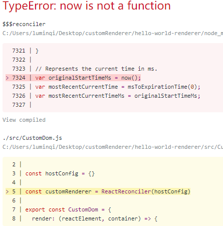

# 自定义渲染器
>本章的代码在CustomRender分支中

## 什么是renderer

简单地说 renderer 把我们的代码渲染在特定的环境中。比如 DomRenderer 把代码渲染在浏览器环境中，NativeRenderer 则是渲染在移动环境中。其他还有 ReactNoopRenderer 是 React 内部用来调试 Fiber 的, ReactTestRenderer 可以将 React 组件渲染成纯 JavaScript 对象，甚至都不需要依赖于 DOM 和原生移动环境。

What's More

一个有趣的项目, 把React组件渲染成一个word文档: [Making-a-custom-React-renderer](https://github.com/nitin42/Making-a-custom-React-renderer)

## 怎样写一个自定义的渲染器

上面的项目已经包含了如何写一个渲染器的教程，你可以选择通过阅读它来完成自己的Renderer。但是我的目标是在浏览器环境中调试React， 所以我需要的是一个简单的DomRenderer。我发现上面的教程对我来说仍然不够简单直接。

[Hello World Custom React Renderer](https://medium.com/@agent_hunt/hello-world-custom-react-renderer-9a95b7cd04bc)

这篇文章(需要翻墙)论述了如何写一个非常简单的 DomRenderer。我强烈建议你自己通过文章里的方法构建一个自己的DomRenderer，因为很可能最终得到的结果和我有所不同(我的结果也和文章里的有区别)。

**简单的说一下步骤：**

1. 用 [create-react-app](https://github.com/facebook/create-react-app) 初始化一个项目
2. 在 App.js 写一个简单的组件
```javascript
    import React, { Component } from 'react';
    import logo from './logo.svg';
    import './App.css';

    class App extends Component {
      constructor(props) {
        super(props);
        this.state = {
          counter: 0,
          value: ''
        };
      }

      handleChange = (event) => {
        this.setState({value: event.target.value});
      }

      render() {
        return (
          <div className="App">
            <header className="App-header">
              
              <h1 className="App-title">Welcome to React</h1>
            </header>
            <div className="App-intro">
              <div className="button-container">
                <button
                  className="decrement-button"
                  onClick={() => this.setState({ counter: this.state.counter - 1 })}
                >
                  -
                </button>
                <div className="counter-text">{this.state.counter}</div>
                <button
                  className="increment-button"
                  onClick={() => this.setState({ counter: this.state.counter + 1 })}
                  >
                  +
                </button>
              </div>
            </div>
          </div>
        );
      }
    }

    export default App;
```

3. 安装 react-reconciler (yarn add react-reconciler)

reconciler 模块是实现 fiber 架构的关键，它接受一个 hostConfig 对象， 返回一个 renderer。
这样设计的原因是为了复用 reconciler 模块, 这样不同的环境可以定义不同的 hostConfig 对象。

在 [React 官方文档](https://reactjs.org/docs/implementation-notes.html)中也提到了

Renderers use injection to pass the host internal class to the reconciler. For example, React DOM tells the reconciler to use ReactDOMComponent as the host internal instance implementation

4. 在 src 目录下新建 CustomDom.js
```javascript
    import ReactReconciler from 'react-reconciler'

    const hostConfig = {}

    const customRenderer = ReactReconciler(hostConfig)

    export const CustomDom = {
      render: (reactElement, container) => {
        let root = container._reactRootContainer
        if (!root) {
          // initial mount
          const isConcurrent = true // concurrent mode
          root = container._reactRootContainer = customRenderer.createContainer(container, isConcurrent)
        }
        customRenderer.updateContainer(reactElement, root)
      }
    }
```
hostConfig 目前只是一个空的对象，我们将会在下面一步一步完善它。
CustomDom 是用来替换 ReacDom 的([ReactDom的源码](https://github.com/facebook/react/blob/master/packages/react-dom/src/client/ReactDOM.js))
注意我们已经做了很多简化工作，我们只保留了 ReactDom 的 render 函数，而且忽略了 render 函数可能传入的第三个 callback 参数。另外注意异步模式默认是不开启的，我们需要令 isConcurrent = true。当我自己实现了 createContainer
函数的时候，我会忽略 isConcurrent 参数， 因为我默认它是 true。

本来异步 React 是叫 Async React，但是现在改为叫 Concurrent React 了， 有兴趣可以看看 dan 在 twitter 上的[讨论](https://twitter.com/dan_abramov/status/1036940380854464512)

通过简化，render函数很容易理解：在第一次调用 CustomDom.render 的时候，即在mount过程中，会调用 createContainer 函数来构造一个 root。 然后将 root 保存到 container 的 _reactRootContainer 属性中。 这样下次再调用 CustomDom.render 的时候就可以使用之前的 root。最后调用 updateContainer 函数渲染组件。

container其实就是一个Dom节点，组件会被渲染在它里面。

这里已经涉及到了 Element, Root 等概念：
* render 函数的第一个参数 reactElement 是一个 Element 对象，关于其介绍以及和 Component，Instance 的区别可以看 React [官方文档](https://reactjs.org/blog/2015/12/18/react-components-elements-and-instances.html)。
简单的来说它是通过 babel 将 jsx 编译成类似于
```javascript
    {
      type: 'div'
      props: {}
    }
```
这样的对象，具体如何实现请看 ReactCore 章节
* Root 是一个 FiberRoot 类的实例，我将会和 Fiber 一起介绍它

5. 在 index.js 中用我们自定义的 Dom 替换 ReactDom
```javascript
    import React from 'react';
    import { CustomDom } from './CustomDom';
    // import ReactDOM from 'react-dom';
    import './index.css';
    import App from './App';
    import registerServiceWorker from './registerServiceWorker';

    CustomDom.render(<App />, document.getElementById('root'));
    // ReactDOM.render(<App />, document.getElementById('root'));
    registerServiceWorker();
```
如果现在运行程序，会抛出如下错误

原因是 reconciler 模块会使用 hostConfig 中定义的 now 函数。 所以我们往 hostConfig 中加入 now 函数：
```javascript
  const hostConfig = {
    now: () => {
      return performance.now()
    }
  }
```
再次运行我们会得到相似的错误，提醒我们需要往 hostConfig 中加入更多函数。
最终完成的hostConfig：
```javascript
    const hostConfig = {
      now: () => {
        return performance.now
      },
      getRootHostContext: () => {
        return null
      },
      getChildHostContext: () => {
        return null
      },
      shouldSetTextContent: (type, props) => {
        return typeof props.children === 'string' || typeof props.children === 'number'
      },
      createInstance: (type) => {
        const domElement = document.createElement(type)
        return domElement
      },
      finalizeInitialChildren: (domElement, type, props) => {
        Object.keys(props).forEach(propKey => {
          const propValue = props[propKey];
          if (propKey === 'children') {
            if (typeof propValue === 'string' || typeof propValue === 'number') {
              domElement.textContent = propValue;
            }
          } else if (propKey === 'className') {
            domElement.setAttribute('class', propValue);
          } else if (propKey === 'onClick') {
            domElement.addEventListener('click', propValue)
          } else {
            const propValue = props[propKey];
            domElement.setAttribute(propKey, propValue);
          }
        })
        return false
      },
      appendInitialChild: (parentInstance, child) => {
        parentInstance.appendChild(child)
      },
      prepareForCommit: () => {
      },
      resetAfterCommit: () => {
      },
      supportsMutation: true,
      appendChildToContainer: (container, child) => {
        container.appendChild(child)
      },
      scheduleDeferredCallback: (callback, options) => {
        requestIdleCallback(callback, options)
      },
      shouldDeprioritizeSubtree: () => {
        return false
      },
      prepareUpdate: (domElement, type, oldProps, newProps) => {
        let updatePayload = null
        Object.keys(newProps).forEach(propKey => {
          let nextProp = newProps[propKey]
          let lastProp = oldProps[propKey]
          if (nextProp !== lastProp && (typeof nextProp === 'string' || typeof nextProp === 'number')) {
            (updatePayload = updatePayload || []).push(propKey, '' + nextProp)
          }
        })
        return updatePayload
      },
      commitUpdate: (domElement, updatePayload) => {
        for (let i = 0; i < updatePayload.length; i += 2) {
          let propKey = updatePayload[i]
          let propValue = updatePayload[i + 1]
          domElement.textContent = propValue
        }
      }
    }
```
现在再运行项目


## 理解hostConfig

hostConfig 中所有的函数都会被 reconciler 模块用到，但是有些函数对我们来说不是很重要，因为我们实现的 SimpleReact 会忽略一些功能，包括 [Context API](https://reactjs.org/blog/2018/03/29/react-v-16-3.html)。
所以在此，我不会深究 getRootHostContext 和 getChildHostContext 函数。另外 prepareForCommit 和 resetAfterCommit函数对我们这个简单的组件也不重要。shouldDeprioritizeSubtree 函数和 hidden 属性有关，这里直接返回 false。

我会逐一介绍剩下的9个函数

### now

返回现在的时间

### shouldSetTextContent

判断组件的直接后代是否是文本或者数字

### createInstance

根据 type 创建 dom 节点， type 即为像 'div' 的等字符

### finalizeInitialChildren

设置 dom 节点的属性，需要注意的是简化了事件绑定，只能识别click事件。后面的事件处理章节将完善这部分逻辑

### appendInitialChild 和 appendChildToContainer

向 dom 节点中添加子节点

### scheduleDeferredCallback

重点是这个函数，它是实现时间分片的基础。我这里为了简化直接调用了 [requestIdleCallback](https://developer.mozilla.org/zh-CN/docs/Web/API/Window/requestIdleCallback)。React有它自己的实现
[unstable_scheduleCallback](https://github.com/facebook/react/blob/master/packages/scheduler/src/Scheduler.js).

实现这个函数的目的就是在浏览器空闲时期完成相应的计算工作，这和Fiber架构息息相关，我将会在下一章节讨论这些问题。

### prepareUpdate 和 commitUpdate

这两个函数将会在组件更新的过程中扮演重要的角色。prepareUpdate 判断组件更新前后 props 是否有变化,
在我们这个简单组件的例子中主要是判断 props.children，即判断更新前后组件的后代是否发生了变化。将变化保存起来。
commitUpdate 会真的应用这些变化，同样在我们的例子中，只考虑children的变化，所以设置 dom 节点的 textContent
属性为新的后代。

## 结论

hostConfig 并没有完全完成。当我们实现了 reconciler 模块的时候，将去掉一些不必要的函数， 加入一些必要的函数。
同时我需要在这里强调为了简化代码而做出的假设：

**当我们考虑组件更新的时候，发生变化的只是文本节点**

这简化了 prepareUpdate 和 commitUpdate 的逻辑， 因为我们不需要考虑各种属性的变化， style 的变化等等。

对于 Fiber 架构， 目前为止我们只知道 reconciler 模块将使用 scheduleDeferredCallback 来实现时间分片。

[下一章节](Fiber.md)


