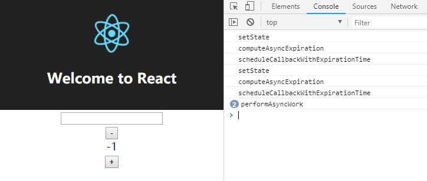
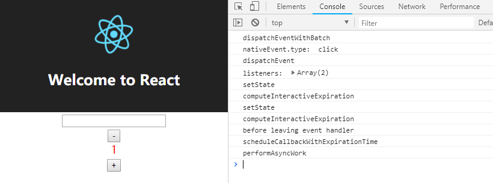
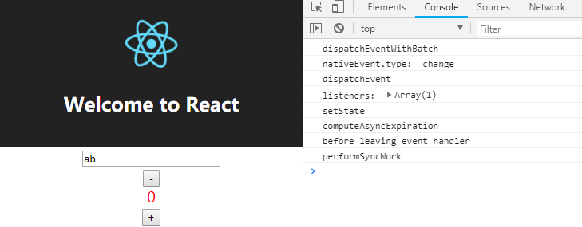

# 事件处理
>本章的代码在Event分支中
## 学习资料
[How exactly does React handles events](https://levelup.gitconnected.com/how-exactly-does-react-handles-events-71e8b5e359f2)

关于 React 的事件处理系统的整体介绍

[Interactive updates](https://github.com/facebook/react/pull/12100)

React 对事件的三种划分：

* Controlled events：更新会被同步地执行。
* Interactive events：比普通的异步更新优先级高，其实就是对应用 computeInteractiveExpiration 计算更新任务到期时间。
* Non-interactive events：低优先级的异步更新，对应用 computeAsyncExpiration 计算更新任务到期时间。

[Does React keep the order for state updates](https://stackoverflow.com/questions/48563650/does-react-keep-the-order-for-state-updates#)

所有发生在 React event handler 中的更新会被批量处理。即当在一个 React event handler 中，不管调用多少 this.setState，只会导致重新渲染一次。

这就是为什么需要 isBatchingUpdates 和 isBatchingInteractiveUpdates 变量。

## 调试

修改一下App.js
```javascript
class ColorText extends Component {
  constructor(props) {
    super(props)
    this.state = {
      colorIndex: 0
    }
  }
  render () {
    const colorPanel = ['red', 'blue']
    return (
      <div
        className="color-flip"
        style={{color: colorPanel[this.state.colorIndex]}}
        onClick={() => this.setState({ colorIndex: (this.state.colorIndex + 1) % colorPanel.length })}
      >
        {this.props.children}
      </div>
    )
  }
}

class App extends Component {
  constructor(props) {
    super(props);
    this.state = {
      counter: 0,
      value: ''
    };
    this.handleChange = this.handleChange.bind(this)
  }

  handleChange (event) {
    this.setState({value: event.target.value});
  }

  render() {
    return (
      <div className="App">
        <header className="App-header">
          
          <h1 className="App-title">Welcome to React</h1>
        </header>
        <div className="App-intro">
          <input type="text" value={this.state.value} onChange={this.handleChange} />
          <ColorText>      
            <div className="button-container">
              <button className="decrement-button" onClick={() => {
                this.setState({ counter: this.state.counter - 1 })
              }}>
                -
              </button>
              <div className="counter-text">{this.state.counter}</div>
              <button className="increment-button" onClick={() => {
                this.setState({ counter: this.state.counter + 1 })
              }}>
                +
              </button>
            </div>
          </ColorText>
        </div>
      </div>
    );
  }
}
```

加入了一个新组件 ColorText，触发点击事件之后改变文本颜色。由于 ColorText 的更新发生在 div 元素的 style 属性上，且加入的 input 元素，它的更新发生在其 value 属性上，所以这违反了之前所作的假设：只有文本节点发生改变。所以需要完善 finalizeInitialChildren，prepareUpdate 和 commitUpdate 函数的逻辑。

```javascript
hostConfig = {
  finalizeInitialChildren: (domElement, props) => {
    Object.keys(props).forEach(propKey => {
      const propValue = props[propKey]
      if (propKey === 'children') {
        if (typeof propValue === 'string' || typeof propValue === 'number') {
          domElement.textContent = propValue
        }
      } else if (propKey === 'style') {
        // 设置初始 style
        const style = domElement.style
        Object.keys(propValue).forEach(styleName => {
          let styleValue = propValue[styleName]
          style.setProperty(styleName, styleValue)
        })
      } else if (propKey === 'className') {
        domElement.setAttribute('class', propValue)
      } else if (propKey === 'onClick') {
        domElement.addEventListener('click', propValue)
      } else {
        const propValue = props[propKey]
        domElement.setAttribute(propKey, propValue)
      }
    })
  },
  prepareUpdate: (oldProps, newProps) => {
    let updatePayload = null
    let styleUpdates = null
    Object.keys(newProps).forEach(propKey => {
      let nextProp = newProps[propKey]
      let lastProp = oldProps[propKey]
      if (nextProp !== lastProp && (typeof nextProp === 'string' || typeof nextProp === 'number')) {
        (updatePayload = updatePayload || []).push(propKey, '' + nextProp)
      }
      if (propKey === 'style') {
        for (let styleName in nextProp) {
          if (nextProp.hasOwnProperty(styleName) && lastProp[styleName] !== nextProp[styleName]) {
            // 新的 style 对象有和之前不同的属性值
            styleUpdates = nextProp
            break
          }
        }
        if (styleUpdates) {
          (updatePayload = updatePayload || []).push(propKey, styleUpdates)
        }
      }
    })
    return updatePayload
  },
  commitUpdate: (domElement, updatePayload) => {
    for (let i = 0; i < updatePayload.length; i += 2) {
      let propKey = updatePayload[i]
      let propValue = updatePayload[i + 1]
      if (propKey === 'children') {
        // 更新后代
        domElement.textContent = propValue
      } else if (propKey === 'style'){
        // 更新样式
        const style = domElement.style
        Object.keys(propValue).forEach(styleName => {
          let styleValue = propValue[styleName]
          style.setProperty(styleName, styleValue)
        })
      } else {
        // 更新属性
        domElement[propKey] = propValue
      }
    }
  }
}
```

在必要的函数添加 console.log，运行项目。



如果点击 - 或 + 按钮，本应该调用 computeInteractiveExpiration，实际上却调用了 computeAsyncExpiration。而且会触发两次 scheduleCallbackWithExpirationTime，一次是 button 上绑定的回调函数被触发调用this.setState。另一次是由于事件冒泡，导致 ColorText 组件中的 div 上绑定的回调函数被触发调用 this.setState。这不是正确的行为，两次更新都 schedule 了更新。正确的行为应该是两次更新触发一次 scheduleCallbackWithExpirationTime。

## 实现

事件处理的实现完全基于我个人的理解，它只考虑了很少的情况，可能完全是错误的。实际上 React 准备 [Drastically simplify the event system](https://github.com/facebook/react/issues/13525)。

首先需要区分 Controlled events， Interactive events 和 Non-interactive events。React 源码 [SimpleEventPlugin.js](https://github.com/facebook/react/blob/master/packages/react-dom/src/events/SimpleEventPlugin.js) 中有 Interactive events 和 Non-interactive events 的完整列举。比如说 click，focus 属于 Interactive events，而 mouseMove 和 drag 属于 Non-interactive events。

那么什么是 Controlled events？

受控组件中，像 &lt;input&gt;, &lt;textarea&gt;, 和 &lt;select&gt; 这类表单元素的 change 事件是一个 Controlled event。

新建一个 isInteractiveEvent.js。

```javascript
const interactiveEventTypeNames = [
  'blur',
  'cancel',
  'click',
  // ...
]
const nonInteractiveEventTypeNames = [
  'abort',
  'animationEnd',
  'animationIteration',
  // ...
]
export const eventTypeNames = [...interactiveEventTypeNames, ...nonInteractiveEventTypeNames]
export const bubblePhaseRegistrationNames = eventTypeNames.map(
  name => 'on' + name[0].toLocaleUpperCase() + name.slice(1)
)
export const capturePhaseRegistrationNames = bubblePhaseRegistrationNames.map(
  name => name + 'Capture'
)
export const registrationNames = [...bubblePhaseRegistrationNames, ...capturePhaseRegistrationNames]
export function isInteractiveEvent (eventType) {
  return interactiveEventTypeNames.includes(eventType)
}
```

* registrationNames 包含了所有 interactiveEvent 和 nonInteractiveEvent 的名称。
* isInteractiveEvent 判断事件是否属于 Interactive events。

createInstance 和 finalizeInitialChildren 需要完善逻辑：

```javascript
hostConfig = {
  createInstance: (type, props, internalInstanceHandle) => {
    const domElement = document.createElement(type)
    // 将传入节点的 props 和该节点的 fiber 保存在创建的 DOM 节点上
    domElement.internalInstanceKey = internalInstanceHandle
    domElement.internalEventHandlersKey = props
    return domElement
  },
  finalizeInitialChildren: (domElement, props) => {
    Object.keys(props).forEach(propKey => {
      const propValue = props[propKey]
      if (propKey === 'children') {
        if (typeof propValue === 'string' || typeof propValue === 'number') {
          domElement.textContent = propValue
        }
      } else if (propKey === 'style') {
        const style = domElement.style
        Object.keys(propValue).forEach(styleName => {
          let styleValue = propValue[styleName]
          style.setProperty(styleName, styleValue)
        })
      } else if (propKey === 'className') {
        domElement.setAttribute('class', propValue)
      } else if (registrationNames.includes(propKey) || propKey === 'onChange') {
        // propKey 是事件名
        let eventType = propKey.slice(2).toLocaleLowerCase()
        if (eventType.endsWith('capture')) {
          eventType = eventType.slice(0, -7)
        }
        // 所有的事件都绑定在 document 上
        document.addEventListener(eventType, customRenderer.dispatchEventWithBatch)
      } else {
        const propValue = props[propKey]
        domElement.setAttribute(propKey, propValue)
      }
    })
  },
}
```

在 Reconciler.js 中加入如下函数

```javascript
let isDispatchControlledEvent = false

function dispatchEventWithBatch (nativeEvent) {
  const type = nativeEvent.type
  let previousIsBatchingInteractiveUpdates = isBatchingInteractiveUpdates
  let previousIsBatchingUpdates = isBatchingUpdates
  let previousIsDispatchControlledEvent = isDispatchControlledEvent
  if (type === 'change') {
    isDispatchControlledEvent = true
  }
  if (isInteractiveEvent(type)) {
    isBatchingInteractiveUpdates = true
  }
  isBatchingUpdates = true
  
  try {
    return dispatchEvent(nativeEvent)
  } finally {
    console.log('before leaving event handler')
    isBatchingInteractiveUpdates = previousIsBatchingInteractiveUpdates
    isBatchingUpdates = previousIsBatchingUpdates
    if (!isBatchingUpdates && !isRendering) {
      if (isDispatchControlledEvent) {
        isDispatchControlledEvent = previousIsDispatchControlledEvent
        if (scheduledRoot) { // if event triggers update
          performSyncWork()
        }  
      } else {
        if (scheduledRoot) {
          scheduleCallbackWithExpirationTime(scheduledRoot, scheduledRoot.expirationTime)
        }
      }
    }
  }
}

function dispatchEvent (nativeEvent) {
  let listeners = []
  const nativeEventTarget = nativeEvent.target || nativeEvent.srcElement
  const targetInst = nativeEventTarget.internalInstanceKey
  // 按照捕获和冒泡的顺序保存所有的回调函数
  traverseTwoPhase(targetInst, accumulateDirectionalDispatches.bind(null, listeners), nativeEvent)
  // 触发所有的回调函数
  listeners.forEach(listener => listener(nativeEvent))
}

function accumulateDirectionalDispatches (acc, inst, phase, nativeEvent) {
  let type = nativeEvent.type
  let registrationName = 'on' + type[0].toLocaleUpperCase() + type.slice(1)
  if (phase === 'captured') {
    registrationName = registrationName + 'Capture'
  }
  const stateNode = inst.stateNode
  const props = stateNode.internalEventHandlersKey
  const listener = props[registrationName]
  if (listener) {
    acc.push(listener)
  }
}

function getParent(inst) {
  do {
    inst = inst.return
  } while (inst && inst.tag !== HostComponent)
  if (inst) {
    return inst
  }
  return null
}

// Simulates the traversal of a two-phase, capture/bubble event dispatch.
export function traverseTwoPhase(inst, fn, arg) {
  const path = []
  while (inst) {
    path.push(inst)
    inst = getParent(inst)
  }
  let i
  for (i = path.length; i-- > 0; ) {
    fn(path[i], 'captured', arg)
  }
  for (i = 0; i < path.length; i++) {
    fn(path[i], 'bubbled', arg)
  }
}
```

isDispatchControlledEvent 变量表示触发的事件是否是 controlled event。

### dispatchEventWithBatch

* 判断事件属于什么类型，如果是 controlled event，让 isDispatchControlledEvent 为 true。如果是 interactive event, 让 isBatchingInteractiveUpdates 为 true。不管是什么类型的事件，让 isBatchingUpdates 为 true。
* 在 try 语句块中调用 dispatchEvent，实际上会调用事件绑定的回调函数，调用 this.setState。由于在 requestWork 中会判断 isBatchingUpdates 是否为真，如果为真则直接返回。所以并不会导致更新。
* 在 finally 语句块中判断触发的事件是否为 controlled event，如果是则调用 performSyncWork 同步渲染。
否则调用 scheduleCallbackWithExpirationTime 异步渲染。

现在再运行项目，点击 - 或 + 按钮：


可以看到触发了 computeInteractiveExpiration，而且只触发一次 scheduleCallbackWithExpirationTime。后面可能会因为耗尽了空闲时间而再次调用 scheduleCallbackWithExpirationTime。 

在文本框中输入字符：


可以看到调用了 performSyncWork。

[下一章](ReactCore.md)
