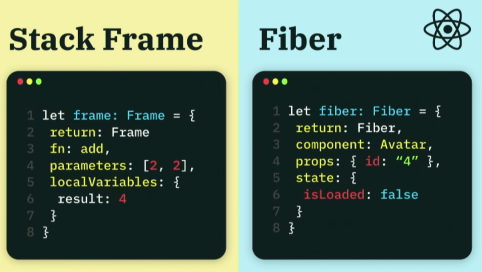
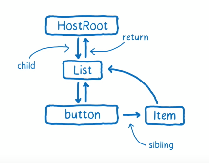

# Fiber 架构

## 为什么需要 Fiber ?

在 Fiber 之前，[Stack Reconciler](https://reactjs.org/docs/implementation-notes.html) 负责完成组件的渲染。简单的说， 一旦我们调用 ReactDOM.render 来进行第一次组件挂载， 或是用户交互触发了 this.setState 更新过程，整个挂载或者更新过程不可能被打断。

因为 Stack Reconciler 就如它的名字一样， 它从根组件开始，递归地调用各个组件的 render 函数来明确渲染什么。整个计算过程是由 javascript stack 控制的，而我们无法控制js栈。

如果计算量庞大，会阻塞浏览器的渲染过程造成卡顿，用户的交互也无法得到实时的反馈。而 Fiber 架构能够解决这些问题。

## 什么是 Fiber ？

社区已经有很多介绍 Fiber 的资料，我首推 [fresh-async-react](https://github.com/sw-yx/fresh-async-react)。 这个项目涵盖了目前为止关于 React 的各种官方和社区的资料，并且在不断更新中。

为了理解 Fiber 架构，我觉得这几个视频有必要重点看一下：
* [Beyond React 16 ](https://www.youtube.com/watch?v=v6iR3Zk4oDY)
* [Lin Clark's A Cartoon Intro to Fiber](https://www.youtube.com/watch?v=ZCuYPiUIONs)
* [Algebraic Effects, Fibers, Coroutines](https://www.youtube.com/watch?v=7GcrT0SBSnI)

最后一个视频非常有用，它让我对 Fiber 为什么被设计成这样，time slicing 和 suspense 是如何实现的有了一个概观。

之前 React 在挂载和更新过程中，本质上就是在调用函数，而函数的执行是由 javascript call stack 控制的，stack frame 则代表了函数的调用。stack frame 的创建销毁都是由 js 引擎完成的，我们不能在程序中使用它。



整个Fiber 架构可以看作实现了一个类似于 javascript call stack 的 React call stack，而具体的单个 fiber 实例可以看作是一个包含了组件信息的 stack frame。 而现在这个call stack是我们能够完全控制的，我们可以创建，删除，复制 stack frame。

就像一个 stack frame 包含了指向当前函数的指针，函数的返回地址，函数参数，临时变量等等，一个 fiber 实例包含了当前的组件信息，父组件 fiber，props， state 等等。

现在，让我们看看真正的 fiber 是什么样子：
```javascript
// A Fiber is work on a Component that needs to be done or was done. There can
// be more than one per component.
type Fiber = {|
  // Tag identifying the type of fiber.
  tag: WorkTag,

  // Unique identifier of this child.
  key: null | string,

  // The function/class/module associated with this fiber.
  type: any,

  // The local state associated with this fiber.
  stateNode: any,

  // Conceptual aliases
  // parent : Instance -> return The parent happens to be the same as the
  // return fiber since we've merged the fiber and instance.

  // Remaining fields belong to Fiber

  // The Fiber to return to after finishing processing this one.
  // This is effectively the parent, but there can be multiple parents (two)
  // so this is only the parent of the thing we're currently processing.
  // It is conceptually the same as the return address of a stack frame.
  return: Fiber | null,

  // Singly Linked List Tree Structure.
  child: Fiber | null,
  sibling: Fiber | null,
  index: number,

  // The ref last used to attach this node.
  // I'll avoid adding an owner field for prod and model that as functions.
  ref: null | (((handle: mixed) => void) & {_stringRef: ?string}) | RefObject,

  // Input is the data coming into process this fiber. Arguments. Props.
  pendingProps: any, // This type will be more specific once we overload the tag.
  memoizedProps: any, // The props used to create the output.

  // A queue of state updates and callbacks.
  updateQueue: UpdateQueue<any> | null,

  // The state used to create the output
  memoizedState: any,

  // A linked-list of contexts that this fiber depends on
  firstContextDependency: ContextDependency<mixed> | null,

  // Bitfield that describes properties about the fiber and its subtree. E.g.
  // the ConcurrentMode flag indicates whether the subtree should be async-by-
  // default. When a fiber is created, it inherits the mode of its
  // parent. Additional flags can be set at creation time, but after that the
  // value should remain unchanged throughout the fiber's lifetime, particularly
  // before its child fibers are created.
  mode: TypeOfMode,

  // Effect
  effectTag: SideEffectTag,

  // Singly linked list fast path to the next fiber with side-effects.
  nextEffect: Fiber | null,

  // The first and last fiber with side-effect within this subtree. This allows
  // us to reuse a slice of the linked list when we reuse the work done within
  // this fiber.
  firstEffect: Fiber | null,
  lastEffect: Fiber | null,

  // Represents a time in the future by which this work should be completed.
  // Does not include work found in its subtree.
  expirationTime: ExpirationTime,

  // This is used to quickly determine if a subtree has no pending changes.
  childExpirationTime: ExpirationTime,

  // This is a pooled version of a Fiber. Every fiber that gets updated will
  // eventually have a pair. There are cases when we can clean up pairs to save
  // memory if we need to.
  alternate: Fiber | null,

  // Time spent rendering this Fiber and its descendants for the current update.
  // This tells us how well the tree makes use of sCU for memoization.
  // It is reset to 0 each time we render and only updated when we don't bailout.
  // This field is only set when the enableProfilerTimer flag is enabled.
  actualDuration?: number,

  // If the Fiber is currently active in the "render" phase,
  // This marks the time at which the work began.
  // This field is only set when the enableProfilerTimer flag is enabled.
  actualStartTime?: number,

  // Duration of the most recent render time for this Fiber.
  // This value is not updated when we bailout for memoization purposes.
  // This field is only set when the enableProfilerTimer flag is enabled.
  selfBaseDuration?: number,

  // Sum of base times for all descedents of this Fiber.
  // This value bubbles up during the "complete" phase.
  // This field is only set when the enableProfilerTimer flag is enabled.
  treeBaseDuration?: number,

  // Conceptual aliases
  // workInProgress : Fiber ->  alternate The alternate used for reuse happens
  // to be the same as work in progress.
  // __DEV__ only
  _debugID?: number,
  _debugSource?: Source | null,
  _debugOwner?: Fiber | null,
  _debugIsCurrentlyTiming?: boolean,
|};
```
React 内部用了flow 作为类型检查。我会介绍下面这些属性，其他的属性不会包含在SimpleReact中。

### tag

tag 代表了 fiber 的类型。可能的类型在 [ReactWorkTags.js](https://github.com/facebook/react/blob/master/packages/shared/ReactWorkTags.js) 中。
为了简化，SimpleReact 将只支持 ClassComponent，HostRoot， HostComponent 类型
* ClassComponent：用户定义的class组件的类型
* HostRoot：根节点的类型
* HostComponent: 特定环境中的原生节点的类型，如 Dom 中 &lt;div&gt;, Native 中的 &lt;View&gt;

### key

创建元素数组时需要包含的特殊字符串， 在某些元素被增加或删除的时候帮助 React 识别哪些元素发生了变化。为了简化，
SimpleReact 不会使用 key 作为识别变化的依据。

### type

* HostRoot 类型的 fiber，type 是 null
* ClassComponent 类型的 fiber， type 是用户声明的组件类的构造函数
* HostComponent 类型的 fiber， type 是节点的标签的字符串表示，即表示 &lt;div&gt; 的 fiber 的 type 是字符串 'div'

### stateNode

* HostRoot 类型的 fiber，stateNode 是一个 FiberRoot 类的实例
* ClassComponent 类型的 fiber，stateNode 是一个用户声明的组件类的实例
* HostComponent 类型的 fiber，stateNode 是该 fiber 表示的 dom 节点

### return, child 和 sibling



return，child 和 sibling 属性构造了一颗 fiber 树

### index

index 会用来判断元素是否发生了移动，我会忽略这个属性，因为我假设**更新永远不会改变元素的位置**。

### ref

我不会实现 [refs 功能](https://react.docschina.org/docs/glossary.html#refs)，忽略这个属性。

### pendingProps, memoizedProps 和 memoizedState

不同 tag 的 fiber 有不同的可能的值 

### updateQueue

状态更新保存在这里

### mode

表示 fiber 的工作模式，可能的值在 [ReactTypeOfMode.js](https://github.com/facebook/react/blob/master/packages/react-reconciler/src/ReactTypeOfMode.js) 中。
我假设所有的 fiber 只工作在 ConcurrentMode，因此忽略这个属性。

### effectTag

effectTag 代表了此 fiber 包含的副作用，可能的值在 [ReactSideEffectTags.js](https://github.com/facebook/react/blob/master/packages/shared/ReactSideEffectTags.js) 中。
为了简化，我假设**组件在渲染过程中只会包含 Placement 和 Update 这两种副作用**。 Placement 副作用表示该 fiber 第一次被挂载，Update 副作用表示该 fiber 包含状态更新。

### nextEffect, firstEffect 和 lastEffect

nextEffect 属性构成了所有包含副作用的 fiber 的一个单向链表。firstEffect 和 lastEffect 分别指向该 fiber 子树(不包含该 fiber 自身)中第一个和最后一个包含副作用的fiber

### expirationTime

代表此 fiber 自身需要被 commit，需要被挂载或更新的最后期限，超过这个期限将会导致这个 fiber 不再等待浏览器的空闲时间来完成它的工作，而是表现的和未激活异步模式一样，同步的完成它的工作。这是为了避免 starvation。

### childExpirationTime

代表子树中的未完成的 fiber 的 expirationTime。我会忽略这个属性。

### alternate

在任何情况下，每个组件实例最多有两个 fiber 何其关联。一个是被 commit 过后的 fiber，即它所包含的副作用已经被应用到了 dom 上了，称它为 current fiber；另一个是现在未被 commit 的 fiber，称为 work-in-progress fiber。

current fiber 的 alternate 是 work-in-progress fiber， 而 work-in-progress fiber 的 alternate 是 current fiber。


## 什么是 FiberRoot ？
```javascript
type BaseFiberRootProperties = {|
  // Any additional information from the host associated with this root.
  containerInfo: any,
  // Used only by persistent updates.
  pendingChildren: any,
  // The currently active root fiber. This is the mutable root of the tree.
  current: Fiber,

  // The following priority levels are used to distinguish between 1)
  // uncommitted work, 2) uncommitted work that is suspended, and 3) uncommitted
  // work that may be unsuspended. We choose not to track each individual
  // pending level, trading granularity for performance.
  //
  // The earliest and latest priority levels that are suspended from committing.
  earliestSuspendedTime: ExpirationTime,
  latestSuspendedTime: ExpirationTime,
  // The earliest and latest priority levels that are not known to be suspended.
  earliestPendingTime: ExpirationTime,
  latestPendingTime: ExpirationTime,
  // The latest priority level that was pinged by a resolved promise and can
  // be retried.
  latestPingedTime: ExpirationTime,

  // If an error is thrown, and there are no more updates in the queue, we try
  // rendering from the root one more time, synchronously, before handling
  // the error.
  didError: boolean,

  pendingCommitExpirationTime: ExpirationTime,
  // A finished work-in-progress HostRoot that's ready to be committed.
  finishedWork: Fiber | null,
  // Timeout handle returned by setTimeout. Used to cancel a pending timeout, if
  // it's superseded by a new one.
  timeoutHandle: TimeoutHandle | NoTimeout,
  // Top context object, used by renderSubtreeIntoContainer
  context: Object | null,
  pendingContext: Object | null,
  // Determines if we should attempt to hydrate on the initial mount
  +hydrate: boolean,
  // Remaining expiration time on this root.
  // TODO: Lift this into the renderer
  nextExpirationTimeToWorkOn: ExpirationTime,
  expirationTime: ExpirationTime,
  // List of top-level batches. This list indicates whether a commit should be
  // deferred. Also contains completion callbacks.
  // TODO: Lift this into the renderer
  firstBatch: Batch | null,
  // Linked-list of roots
  nextScheduledRoot: FiberRoot | null,
|};
```
