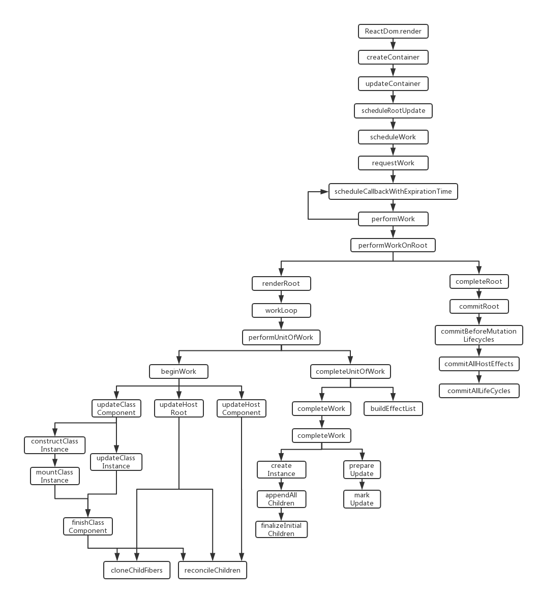

# Fiber 架构
>本章的代码在Fiber分支中

在 CustomRenderer 章节，我们定义了一个简单组件，通过初次渲染和点击按钮，可以调试 React 的 mount 和 update 阶段。在 ReactReconciler 中的函数入口加上 console.log, 可以得到其触发函数的流程图。



注意这不是完整的 React 内部被触发的函数流程图。我已经省略了许多与错误处理等功能相关的函数，并且没有把我决定留下的函数都放在图中，这是为了尽可能不让它看起来过于复杂。

我会按函数的触发先后顺序来介绍它们。并且我把这整个流程图大致分为三个阶段：schedule 阶段，render 阶段 和 commit 阶段。这样划分只是为了方便陈述，如果你看了 [Lin Clark's A Cartoon Intro to Fiber](https://www.youtube.com/watch?v=ZCuYPiUIONs)，里面只有 render 和 commit 的划分。

在 src 文件夹下新建一个文件夹 reconciler, 与 reconciler 模块相关的代码都将放在其中。将上一章提到的 ReactFiber.js，ReactFiberRoot.js，ReactFiberExpirationTIme.js 和 ReactUpdateQueue.js 复制到里面，并新建一个文件 Reconciler.js.

Reconciler.js 的代码结构：
```javascript
// do some import

function Reconciler (hostConfig) {

  const now = hostConfig.now
  const shouldSetTextContent = hostConfig.shouldSetTextContent
  const createInstance = hostConfig.createInstance
  const finalizeInitialChildren = hostConfig.finalizeInitialChildren
  const appendInitialChild = hostConfig.appendInitialChild
  const scheduleDeferredCallback = hostConfig.scheduleDeferredCallback
  const prepareUpdate = hostConfig.prepareUpdate
  const appendChildToContainer = hostConfig.appendChildToContainer
  const commitUpdate = hostConfig.commitUpdate
  
  // Variables

  // functions

  return {
    createContainer,
    updateContainer
  }
}

export default Reconciler
```

在 CustomDom.js 中原来 import 的是 'react-reconciler'， 现在改为 import  ReactReconciler from './reconciler/Reconciler'。让我们一步一步完善 Reconciler.js。

## schedule 阶段
```javascript
// in index.js
CustomDom.render(<App />, document.getElementById('root'))

// in CustomDom.js
const CustomDom = {
  render: (reactElement, container) => {
    let root = container._reactRootContainer
    if (!root) {
      root = container._reactRootContainer = customRenderer.createContainer(container)
    }
    customRenderer.updateContainer(reactElement, root)
  }
};

// in Reconciler.js
let scheduledRoot = null
let isRendering = false
let isWorking = false
let isCommitting = false
let originalStartTimeMs = now()
let currentRendererTime = msToExpirationTime(originalStartTimeMs)
let currentSchedulerTime = currentRendererTime
let nextRenderExpirationTime = NoWork
let isBatchingInteractiveUpdates = false

function createContainer (containerInfo) {
  return createFiberRoot(containerInfo)
}

function updateContainer (element, container) {
  const current = container.current
  const currentTime = requestCurrentTime()
  const expirationTime = computeExpirationForFiber(currentTime)
  return scheduleRootUpdate(current, element, expirationTime)
}

function requestCurrentTime() {
  if (isRendering) {
    return currentSchedulerTime
  }
  if (!scheduledRoot) {
    recomputeCurrentRendererTime()
    currentSchedulerTime = currentRendererTime;
    return currentSchedulerTime
  }
  return currentSchedulerTime
}

function recomputeCurrentRendererTime () {
  let currentTimeMs = now() - originalStartTimeMs
  currentRendererTime = msToExpirationTime(currentTimeMs)
}

function computeExpirationForFiber (currentTime) {
  let expirationTime
  if (isWorking) {
    if (isCommitting) {
      expirationTime = Sync
    } else {
      expirationTime = nextRenderExpirationTime
    }
  } else {
    if (isBatchingInteractiveUpdates) {
      expirationTime = computeInteractiveExpiration(currentTime);
    } else {
      expirationTime = computeAsyncExpiration(currentTime);
    }
  }
  return expirationTime;
}
```

当我们初次调用 CustomDom.render 时，首先会调用 createContainer 创建一个 fiberRoot，然后调用 updateContainer 来渲染组件。注意传入 createContainer 的参数 container 就是我们希望组件渲染在其之下的 DOM 节点。传入 updateContainer 的第一个参数就是&lt;App /&gt; 对应的 Elmenet 对象。Elmenet 对象将在 ReactCore 章节介绍。

在 updateContainer 中， 会调用 requestCurrentTime 得到现在的相对时间，然后调用 computeExpirationForFiber 计算这个 fiber 预期被完成的期限, 最后调用 scheduleRootUpdate。这里有几个全局变量：

* isRendering：注意这个变量的名字有点混淆，它并不代表 render 阶段，而代表了 React 正在渲染。渲染的阶段包括了 render 和 commit 阶段。真正的 render 阶段并没有相应的变量来指示，而是通过 isWorking && !isCommitting 来判断。
* isWorking：表示 fiber 是否在 render 或者 commit 阶段 
* isCommitting: 表示 fiber 是否在 commit 阶段
* scheduledRoot：表示是否存在待完成的工作
* originalStartTimeMs：表示最初的时间起点
* currentRendererTime 和 currentSchedulerTime：请看 [Always batch updates of like priority within the same event (#13071)](https://github.com/facebook/react/pull/13071)
* nextRenderExpirationTime: 表示目前在 render 阶段的 fiber 的 expirationTime
* isBatchingInteractiveUpdates：表示是否是在 batch 用户交互触发的更新(与事件处理相关，现在可以认为它的值一直为 false)

### requestCurrentTime

requestCurrentTime 函数有三种情况：

* 如果现在 React 正在渲染，将返回现在的 currentSchedulerTime，对应的情况：在生命周期函数中调用 this.setState。
* 如果 React 不在渲染且没有待完成的工作，将重新计算现在的相对时间。
* 如果有待完成的工作，将返回现在的 currentSchedulerTime，对应的情况：在一个事件触发回调函数中调用多个 this.setState，所有的更新都将拥有和第一次 setState 时相同的 currentTime。

### computeExpirationForFiber

computeExpirationForFiber 函数有四种情况：

* 如果现在在 commit 阶段，返回 Sync(同步)，对应的情况：在 commit 阶段的生命周期函数中调用 this.setState。
* 如果现在在 render 阶段，返回目前在 render 阶段的 fiber 的 expirationTime，对于的情况：在 render 阶段的生命周期函数中调用 this.setState。
* 如果本次更新是用户交互触发的更新，调用 computeInteractiveExpiration 计算相应的到期时间
* 如果本次更新是普通的异步更新，调用 computeAsyncExpiration 计算相应的到期时间

```javascript
let isBatchingUpdates = false
let deadline = null
let deadlineDidExpire = false

function scheduleRootUpdate (current, element, expirationTime) {
  const update = createUpdate()
  update.payload = {element}
  enqueueUpdate(current, update)
  scheduleWork(current, expirationTime)
  return expirationTime
}

function scheduleWorkToRoot (fiber, expirationTime) {
  if (
    fiber.expirationTime === NoWork ||
    fiber.expirationTime > expirationTime
  ) {
    fiber.expirationTime = expirationTime
  }
  let alternate = fiber.alternate
  if (
    alternate !== null &&
    (alternate.expirationTime === NoWork ||
      alternate.expirationTime > expirationTime)
  ) {
    alternate.expirationTime = expirationTime
  }
  let node = fiber
  while (node !== null) {
    if (node.return === null && node.tag === HostRoot) {
      return node.stateNode
    }
    node = node.return
  }
  return null
}

function scheduleWork (fiber, expirationTime) {
  const root = scheduleWorkToRoot(fiber, expirationTime)
  root.expirationTime = expirationTime
  if (
    !isWorking ||
    isCommitting
  ) {
    requestWork(root, expirationTime)
  }
}

function requestWork (root, expirationTime) {
  scheduledRoot = root
  if (isRendering) {
    return
  }

  if (isBatchingUpdates) {
    return
  }

  if (expirationTime === Sync) {
    performSyncWork()
  } {
    scheduleCallbackWithExpirationTime(root, expirationTime)
  }
}

function scheduleCallbackWithExpirationTime(root, expirationTime) {
  const currentMs = now() - originalStartTimeMs;
  const expirationTimeMs = expirationTimeToMs(expirationTime);
  const timeout = expirationTimeMs - currentMs;
  scheduleDeferredCallback(performAsyncWork, {timeout});
}

function performSyncWork() {
  performWork(null)
}

function performAsyncWork (dl) {
  performWork(dl)
}

function performWork (dl) {
  deadline = dl;
  // Keep working on roots until there's no more work, or until we reach
  // the deadline.
  if (deadline !== null) {
    recomputeCurrentRendererTime()
    currentSchedulerTime = currentRendererTime
    while (
      scheduledRoot !== null &&
      (!deadlineDidExpire || currentRendererTime >= scheduledRoot.expirationTime)
    ) {
      performWorkOnRoot(
        scheduledRoot,
        currentRendererTime >= scheduledRoot.expirationTime
      )
      recomputeCurrentRendererTime()
      currentSchedulerTime = currentRendererTime
    }
  } else {
    while (scheduledRoot !== null) {
      performWorkOnRoot(scheduledRoot, true)
    }
  }
  // We're done flushing work. Either we ran out of time in this callback,
  // or there's no more work left with sufficient priority.
  // If there's work left over, schedule a new callback.
  if (scheduledRoot) {
    scheduleCallbackWithExpirationTime(
      scheduledRoot,
      scheduledRoot.expirationTime,
    );
  }
  // Clean-up.
  deadline = null;
  deadlineDidExpire = false;
}


function shouldYield () {
  if (deadlineDidExpire) {
    return true
  } 
  if (deadline === null || deadline.timeRemaining() > timeHeuristicForUnitOfWork) {
    return false
  }
  deadlineDidExpire = true
  return true
}

function performWorkOnRoot(root, isExpired) {
  isRendering = true
  if (isExpired) {
    // Flush work without yielding.
    let finishedWork = root.finishedWork
    if (finishedWork !== null) {
      // This root is already complete. We can commit it.
      completeRoot(root, finishedWork)
    } else {
      root.finishedWork = null
      const isYieldy = false
      renderRoot(root, isYieldy)
      finishedWork = root.finishedWork
      if (finishedWork !== null) {
        // We've completed the root. Commit it.
        completeRoot(root, finishedWork)
      }
    }
  } else {
    // Flush async work.
    let finishedWork = root.finishedWork;
    if (finishedWork !== null) {
      // This root is already complete. We can commit it.
      completeRoot(root, finishedWork);
    } else {
      root.finishedWork = null
      const isYieldy = true
      renderRoot(root, isYieldy)
      finishedWork = root.finishedWork
      if (finishedWork !== null) {
        // We've completed the root. Check the deadline one more time
        // before committing.
        if (!shouldYield()) {
          // Still time left. Commit the root.
          completeRoot(root, finishedWork)
        } else {
          // There's no time left. Mark this root as complete. We'll come
          // back and commit it later.
          root.finishedWork = finishedWork
        }
      }
    }
  }
  isRendering = false
}
```
这里有几个新出现的全局变量：

* isBatchingUpdates: 表明现在正在 batch 更新(与事件处理相关，现在可以认为它的值一直为 false)。
* deadline：用来保存 requestIdleCallback 传递给即将被调用的函数的名为 deadline 的参数。如果不理解请看 requestIdleCallback 的[介绍](https://developer.mozilla.org/zh-CN/docs/Web/API/Window/requestIdleCallback)。
* deadlineDidExpire: 表示本次调用 requestIdleCallback 分配的空闲时间已经用完了。

### scheduleRootUpdate

需要注意 update 的 payload 的 element 属性是一个 Element 对象

### scheduleWork

首先调用 scheduleWorkToRoot 更新


