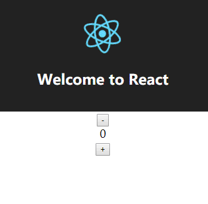

# Fiber 架构
>本章的代码在Fiber分支中

在 CustomRenderer 章节，我们定义了一个简单组件，通过初次渲染和点击按钮，可以调试 React 的 mount 和 update 阶段。在 ReactReconciler 中的函数入口加上 console.log, 可以得到其触发函数的流程图。


注意这不是完整的 React 内部被触发的函数流程图。我已经省略了许多与错误处理等功能相关的函数，并且没有把我决定留下的函数都放在图中，这是为了尽可能不让它看起来过于复杂。

我会按函数的触发先后顺序来介绍它们。并且我把这整个流程图大致分为三个阶段：schedule 阶段，render 阶段 和 commit 阶段。这样划分只是为了方便陈述，如果你看了 [Lin Clark's A Cartoon Intro to Fiber](https://www.youtube.com/watch?v=ZCuYPiUIONs)，里面只有 render 和 commit 的划分。

在 src 文件夹下新建一个文件夹 reconciler, 与 reconciler 模块相关的代码都将放在其中。将上一章提到的 ReactFiber.js，ReactFiberRoot.js，ReactFiberExpirationTIme.js 和 ReactUpdateQueue.js 复制到里面，并新建一个文件 Reconciler.js.

Reconciler.js 的代码结构：
```javascript
// do some import

function Reconciler (hostConfig) {

  const now = hostConfig.now
  const shouldSetTextContent = hostConfig.shouldSetTextContent
  const createInstance = hostConfig.createInstance
  const finalizeInitialChildren = hostConfig.finalizeInitialChildren
  const appendInitialChild = hostConfig.appendInitialChild
  const scheduleDeferredCallback = hostConfig.scheduleDeferredCallback
  const prepareUpdate = hostConfig.prepareUpdate
  const appendChildToContainer = hostConfig.appendChildToContainer
  const commitUpdate = hostConfig.commitUpdate
  
  // Variables

  // functions

  return {
    createContainer,
    updateContainer
  }
}

export default Reconciler
```

在 CustomDom.js 中原来 import 的是 'react-reconciler'， 现在改为 import  ReactReconciler from './reconciler/Reconciler'。让我们一步一步完善 Reconciler.js。

## schedule 阶段
```javascript
// in index.js
CustomDom.render(<App />, document.getElementById('root'))

// in CustomDom.js
const CustomDom = {
  render: (reactElement, container) => {
    let root = container._reactRootContainer
    if (!root) {
      root = container._reactRootContainer = customRenderer.createContainer(container)
    }
    customRenderer.updateContainer(reactElement, root)
  }
}

// in Reconciler.js
let scheduledRoot = null
let isRendering = false
let isWorking = false
let isCommitting = false
let originalStartTimeMs = now()
let currentRendererTime = msToExpirationTime(originalStartTimeMs)
let currentSchedulerTime = currentRendererTime
let nextRenderExpirationTime = NoWork
let isBatchingInteractiveUpdates = false

function createContainer (containerInfo) {
  return createFiberRoot(containerInfo)
}

function updateContainer (element, container) {
  const current = container.current
  const currentTime = requestCurrentTime()
  const expirationTime = computeExpirationForFiber(currentTime)
  return scheduleRootUpdate(current, element, expirationTime)
}

function requestCurrentTime() {
  if (isRendering) {
    return currentSchedulerTime
  }
  if (!scheduledRoot) {
    recomputeCurrentRendererTime()
    currentSchedulerTime = currentRendererTime
    return currentSchedulerTime
  }
  return currentSchedulerTime
}

function recomputeCurrentRendererTime () {
  let currentTimeMs = now() - originalStartTimeMs
  currentRendererTime = msToExpirationTime(currentTimeMs)
}

function computeExpirationForFiber (currentTime) {
  let expirationTime
  if (isWorking) {
    if (isCommitting) {
      expirationTime = Sync
    } else {
      expirationTime = nextRenderExpirationTime
    }
  } else {
    if (isBatchingInteractiveUpdates) {
      expirationTime = computeInteractiveExpiration(currentTime)
    } else {
      expirationTime = computeAsyncExpiration(currentTime)
    }
  }
  return expirationTime
}
```

当我们初次调用 CustomDom.render 时，首先会调用 createContainer 创建一个 fiberRoot，然后调用 updateContainer 来渲染组件。注意传入 createContainer 的参数 container 就是我们希望组件渲染在其之下的 DOM 节点。传入 updateContainer 的第一个参数就是&lt;App /&gt; 对应的 Elmenet 对象。Elmenet 对象将在 ReactCore 章节介绍。

在 updateContainer 中， 会调用 requestCurrentTime 得到现在的相对时间，然后调用 computeExpirationForFiber 计算这个 fiber 预期被完成的期限, 最后调用 scheduleRootUpdate。这里有几个全局变量：

* isRendering：注意这个变量的名字有点混淆，它并不代表 render 阶段，而代表了 React 正在渲染。渲染的阶段包括了 render 和 commit 阶段。真正的 render 阶段并没有相应的变量来指示，而是通过 isWorking && !isCommitting 来判断。
* isWorking：表示 fiber 是否在 render 或者 commit 阶段 
* isCommitting: 表示 fiber 是否在 commit 阶段
* scheduledRoot：表示是否存在待完成的工作
* originalStartTimeMs：表示最初的时间起点
* currentRendererTime 和 currentSchedulerTime：请看 [Always batch updates of like priority within the same event (#13071)](https://github.com/facebook/react/pull/13071)
* nextRenderExpirationTime: 表示目前在 render 阶段的 fiber 的 expirationTime
* isBatchingInteractiveUpdates：表示是否是在 batch 用户交互触发的更新(与事件处理相关，现在可以认为它的值一直为 false)

### requestCurrentTime

requestCurrentTime 函数有三种情况：

* 如果现在 React 正在渲染，将返回现在的 currentSchedulerTime，对应的情况：在生命周期函数中调用 this.setState。
* 如果 React 不在渲染且没有待完成的工作，将重新计算现在的相对时间。
* 如果有待完成的工作，将返回现在的 currentSchedulerTime，对应的情况：在一个事件触发回调函数中调用多个 this.setState，所有的更新都将拥有相同的 currentTime。

### computeExpirationForFiber

computeExpirationForFiber 函数有四种情况：

* 如果现在在 commit 阶段，返回 Sync(同步)，对应的情况：在 commit 阶段的生命周期函数中调用 this.setState。
* 如果现在在 render 阶段，返回目前在 render 阶段的 fiber 的 expirationTime。
* 如果本次更新是用户交互触发的更新，调用 computeInteractiveExpiration 计算相应的到期时间
* 如果本次更新是普通的异步更新，调用 computeAsyncExpiration 计算相应的到期时间

```javascript
let isBatchingUpdates = false
let deadline = null
let deadlineDidExpire = false

function scheduleRootUpdate (current, element, expirationTime) {
  const update = createUpdate()
  update.payload = {element}
  enqueueUpdate(current, update)
  scheduleWork(current, expirationTime)
  return expirationTime
}

function scheduleWorkToRoot (fiber, expirationTime) {
  if (
    fiber.expirationTime === NoWork ||
    fiber.expirationTime > expirationTime
  ) {
    fiber.expirationTime = expirationTime
  }
  let alternate = fiber.alternate
  if (
    alternate !== null &&
    (alternate.expirationTime === NoWork ||
      alternate.expirationTime > expirationTime)
  ) {
    alternate.expirationTime = expirationTime
  }
  let node = fiber
  while (node !== null) {
    if (node.return === null && node.tag === HostRoot) {
      // return a FiberRoot instance
      return node.stateNode
    }
    node = node.return
  }
  return null
}

function scheduleWork (fiber, expirationTime) {
  const root = scheduleWorkToRoot(fiber, expirationTime)
  root.expirationTime = expirationTime
  requestWork(root, expirationTime)
}

function requestWork (root, expirationTime) {
  scheduledRoot = root
  if (isRendering) {
    return
  }

  if (isBatchingUpdates) {
    return
  }

  if (expirationTime === Sync) {
    performSyncWork()
  } else {
    scheduleCallbackWithExpirationTime(root, expirationTime)
  }
}

function scheduleCallbackWithExpirationTime(root, expirationTime) {
  const currentMs = now() - originalStartTimeMs
  const expirationTimeMs = expirationTimeToMs(expirationTime)
  const timeout = expirationTimeMs - currentMs
  scheduleDeferredCallback(performAsyncWork, {timeout})
}

function performSyncWork() {
  performWork(null)
}

function performAsyncWork (dl) {
  performWork(dl)
}

function performWork (dl) {
  deadline = dl
  // Keep working on roots until there's no more work, or until we reach
  // the deadline.
  if (deadline !== null) {
    recomputeCurrentRendererTime()
    currentSchedulerTime = currentRendererTime
    while (
      scheduledRoot !== null &&
      (!deadlineDidExpire || currentRendererTime >= scheduledRoot.expirationTime)
    ) {
      performWorkOnRoot(
        scheduledRoot,
        currentRendererTime >= scheduledRoot.expirationTime
      )
      recomputeCurrentRendererTime()
      currentSchedulerTime = currentRendererTime
    }
  } else {
    while (scheduledRoot !== null) {
      performWorkOnRoot(scheduledRoot, true)
    }
  }
  // We're done flushing work. Either we ran out of time in this callback,
  // or there's no more work left with sufficient priority.
  // If there's work left over, schedule a new callback.
  if (scheduledRoot) {
    scheduleCallbackWithExpirationTime(
      scheduledRoot,
      scheduledRoot.expirationTime,
    )
  }
  // Clean-up.
  deadline = null
  deadlineDidExpire = false
}

function shouldYield () {
  if (deadlineDidExpire) {
    return true
  } 
  if (deadline === null || deadline.timeRemaining() > timeHeuristicForUnitOfWork) {
    return false
  }
  deadlineDidExpire = true
  return true
}

function performWorkOnRoot(root, isExpired) {
  isRendering = true
  if (isExpired) {
    // Flush work without yielding.
    let finishedWork = root.finishedWork
    if (finishedWork !== null) {
      // This root is already complete. We can commit it.
      completeRoot(root, finishedWork)
    } else {
      root.finishedWork = null
      const isYieldy = false
      renderRoot(root, isYieldy)
      finishedWork = root.finishedWork
      if (finishedWork !== null) {
        // We've completed the root. Commit it.
        completeRoot(root, finishedWork)
      }
    }
  } else {
    // Flush async work.
    let finishedWork = root.finishedWork
    if (finishedWork !== null) {
      // This root is already complete. We can commit it.
      completeRoot(root, finishedWork)
    } else {
      root.finishedWork = null
      const isYieldy = true
      renderRoot(root, isYieldy)
      finishedWork = root.finishedWork
      if (finishedWork !== null) {
        // We've completed the root. Check the deadline one more time
        // before committing.
        if (!shouldYield()) {
          // Still time left. Commit the root.
          completeRoot(root, finishedWork)
        } else {
          // There's no time left. Mark this root as complete. We'll come
          // back and commit it later.
          root.finishedWork = finishedWork
        }
      }
    }
  }
  isRendering = false
}
```
这里有几个新出现的全局变量：

* isBatchingUpdates: 表明现在正在 batch 更新(与事件处理相关，现在可以认为它的值一直为 false)。
* deadline：用来保存 requestIdleCallback 传递给即将被调用的函数的名为 deadline 的参数。deadline 具有一个 timeRemaining 属性，可以通过调用 deadline.timeRemaining() 来得到剩余的空闲时间。如果不理解请看 requestIdleCallback 的[介绍](https://developer.mozilla.org/zh-CN/docs/Web/API/Window/requestIdleCallback)。
* deadlineDidExpire: 表示本次调用 requestIdleCallback 分配的空闲时间是否已经用完。

### scheduleRootUpdate

需要注意 update 的 payload，是一个对象。这个对象有一个 element 属性，保存的是一个 ReactElement 对象。

### scheduleWork

* 调用 scheduleWorkToRoot 更新 fiber 的 expirationTime, 如果 fiber 有 alternate，也更新 alternate 的 expirationTime。scheduleWorkToRoot 会返回此 fiber 的 root，注意这个 root 是一个 FiberRoot 实例。
* 更新 root 的 expirationTime。
* 调用 requestWork。

### requestWork

* scheduledRoot = root 将当前存在更新的 root 赋值给 scheduledRoot，在下面介绍的 completeRoot 函数中将会重置 scheduledRoot。
* 如果 React 正在渲染，直接返回，对应在生命周期函数中调用 this.setState。
* 如果正在批量更新，直接返回，对应在一个事件回调中调用 this.setState。
* 如果是同步更新，调用 performSyncWork，否则调用 scheduleCallbackWithExpirationTime。

### scheduleCallbackWithExpirationTime

* 计算工作期限
* 调用 scheduleDeferredCallback(requestIdleCallback) 让 performAsyncWork 在浏览器空闲时间再运行。

### performSyncWork 和 performAsyncWork

两者都调用了 performWork，performSyncWork 传入 null， performAsyncWork 传入 deadline。

### performWork

* 值得注意的是 while 循环的判断条件。异步情况的条件意味着当 scheduledRoot === null，即没有待完成的工作的时候，会退出循环。当 deadlineDidExpire === true && currentRendererTime < scheduledRoot.expirationTime 的时候也会退出循环
, 这种情况意味着本次调用 requestIdleCallback 分配的空闲时间已经用完，而本次工作并没有超过预期完成的期限，所以需要再次调用 requestIdleCallback 来分配空闲时间。
* 当异步任务的 currentRendererTime >= scheduledRoot.expirationTime，即已经超过了本次工作的期限，实际上就会和同步任务一样调用  performWorkOnRoot(scheduledRoot, true)。
* 根据上面的陈述，当我们退出循环的时候，要么已经完成了工作，要么本次分配的空闲时间已经用完，所以如果仍然有待完成的工作，就调用 scheduleCallbackWithExpirationTime，为 performAsyncWork 再分配空闲时间。
* 重置 deadline 和 deadlineDidExpire，注意重置的时机在下一次执行 performAsyncWork 之前。

### performWorkOnRoot

* 根据第二个参数 isExpired 的值来判断工作是否已经到期，同步更新等同于异步更新到期。
* 不论工作有没有到期，都先看 root.finishedWork 是否存在，如果存在表示我们已经可以进入 commit 阶段了。
* 否则先调用 renderRoot 进入 render 阶段，结束之后再调用 completeRoot 进入 commit 阶段。工作到期或者没到期的区别在于传入 renderRoot 的第二个参数不同，以及在调用 completeRoot 之前是否需要再判断一次是否有剩余的空闲时间。
* 异步任务有两种情况会因为没有空闲时间而回到 performWork 中，一种是在执行 renderRoot 过程中就已经用完了空闲时间，一种是在执行 completeRoot 之前已经没有了空闲时间。回到 performWork 中之后，如果任务的预期完成期限已经到期，就会同步执行任务，否则调用 scheduleCallbackWithExpirationTime 分配新的空闲时间。
* 需要注意的是 isRendering 在 performWorkOnRoot 开始时置为 true，结束时置为 false，标志着渲染过程的开始和结束。

### shouldYield

判断本次调用 requestIdleCallback 分配的空闲时间是否有剩余，同时更新 deadlineDidExpire 的值。注意判断的依据 timeHeuristicForUnitOfWork 的值为 1。

## render 阶段
```javascript
let nextUnitOfWork = null

// This is used to create an alternate fiber to do work on.
function createWorkInProgress(current, pendingProps, expirationTime) {
  let workInProgress = current.alternate
  if (workInProgress === null) {
    // We use a double buffering pooling technique because we know that we'll
    // only ever need at most two versions of a tree. We pool the "other" unused
    // node that we're free to reuse. This is lazily created to avoid allocating
    // extra objects for things that are never updated. It also allow us to
    // reclaim the extra memory if needed.
    workInProgress = new FiberNode(current.tag, pendingProps)
    workInProgress.type = current.type
    workInProgress.stateNode = current.stateNode
    workInProgress.alternate = current
    current.alternate = workInProgress
  } else {
    workInProgress.pendingProps = pendingProps

    // We already have an alternate.
    // Reset the effect tag.
    workInProgress.effectTag = NoEffect

    // The effect list is no longer valid.
    workInProgress.nextEffect = null
    workInProgress.firstEffect = null
    workInProgress.lastEffect = null
  }

  if (pendingProps !== current.pendingProps) {
    // This fiber has new props.
    workInProgress.expirationTime = expirationTime
  } else {
    // This fiber's props have not changed.
    workInProgress.expirationTime = current.expirationTime
  }

  workInProgress.child = current.child
  workInProgress.memoizedProps = current.memoizedProps
  workInProgress.memoizedState = current.memoizedState
  workInProgress.updateQueue = current.updateQueue

  // These will be overridden during the parent's reconciliation
  workInProgress.sibling = current.sibling

  return workInProgress
}

function renderRoot (root, isYieldy) {
  isWorking = true
  const expirationTime = root.expirationTime
  if (expirationTime !== nextRenderExpirationTime || nextUnitOfWork === null) {
    nextRenderExpirationTime = expirationTime
    nextUnitOfWork = createWorkInProgress(root.current, null, nextRenderExpirationTime)
  }
  workLoop(isYieldy)
  // We're done performing work. Time to clean up.
  isWorking = false
  if (nextUnitOfWork !== null) {
    return
  }
  // Ready to commit.
  root.finishedWork = root.current.alternate
}

function workLoop (isYieldy) {
  if (!isYieldy) {
    // Flush work without yielding
    while (nextUnitOfWork !== null) {
      nextUnitOfWork = performUnitOfWork(nextUnitOfWork)
    }
  } else {
    // Flush asynchronous work until the deadline runs out of time.
    while (nextUnitOfWork !== null && !shouldYield()) {
      nextUnitOfWork = performUnitOfWork(nextUnitOfWork)
    }
  }
}

function performUnitOfWork (workInProgress) {
  const current = workInProgress.alternate
  let next = null
  next = beginWork(current, workInProgress, nextRenderExpirationTime)
  if (next === null) {
    next = completeUnitOfWork(workInProgress)
  }
  return next
}

function beginWork (current, workInProgress, renderExpirationTime) {
  // Before entering the begin phase, clear the expiration time.
  workInProgress.expirationTime = NoWork
  const Component = workInProgress.type
  const unresolvedProps = workInProgress.pendingProps
  switch (workInProgress.tag) {
    case ClassComponent: {
      return updateClassComponent(current, workInProgress, Component, unresolvedProps, renderExpirationTime)
    }
    case HostRoot: {
      return updateHostRoot(current, workInProgress, renderExpirationTime)
    }
    case HostComponent:{
      return updateHostComponent(current, workInProgress, renderExpirationTime)
    }
    default:
      throw new Error('unknown unit of work tag') 
  }
}
```
新出现的全局变量 nextUnitOfWork 代表我们正在工作的 work-in-progress fiber。当我们在初始 mount 阶段时，current fiber 树只有一个根节点。在 renderRoot 函数中，会调用 createWorkInProgress 生成一个 work-in-progress 根节点，然后这个节点就会作为第一个被传入 performUnitOfWork 的 fiber。performUnitOfWork 会最终返回一个传入节点的子节点，这个节点本身又会被传入 performUnitOfWork，直到生成一颗完整的 work-in-progress fiber 树。这颗 work-in-progress fiber 树被 commit 之后，就会赋值给 root.current，成为新的 current fiber 树。

在 update 阶段，一样的过程被重复，不同的地方是current fiber 树不仅仅只有一个根节点，而是之前被 commit 的 work-in-progress fiber 树。

### renderRoot

* nextUnitOfWork 初始化为根节点的 work-in-progress fiber。
* 开始 workLoop，注意 workLoop 的前后 isWorking 的值。
* 从 workLoop 中返回之后，如果 nextUnitOfWork 仍然存在， 那么直接返回。这种情况意味着我们在 workLoop 中耗尽了本次分配的空闲时间，而没有完成所有的任务。
* 否则，设置 root.finishedWork 为 root 的 work-in-progress fiber，注意不是 root.current，因为所有的副作用都标志在 work-in-progress fiber 上。

### workLoop

* 同步和异步的区别在于 while 循环是否需要判断空闲时间是否使用完，同步任务会一直执行到结束，而异步任务会因为没有空闲时间而返回。

### performUnitOfWork

* 先调用 beginWork 生成 work-in-progress fiber 的 child
* 如果 child 不存在，表示我们当前的  work-in-progress fiber 没有子节点了，调用 completeUnitOfWork。

### beginWork

* 根据 tag 来调用函数。简化了逻辑，只支持 ClassComponent，HostRoot 和 HostComponent。三个函数都会生成并返回 workInProgress.child。
* 在前面一章已经提到，tag 为 ClassComponent 的 fiber 的 type 属性是构造函数，这个构造函数会传入 updateClassComponent。
 
```javascript
function updateClassComponent (current, workInProgress, Component, nextProps, renderExpirationTime) {
  let shouldUpdate
  if (current === null) {
    constructClassInstance(workInProgress, Component, nextProps)
    mountClassInstance(workInProgress, Component, nextProps)
    shouldUpdate = true
  } else {
    shouldUpdate = updateClassInstance(current, workInProgress, Component, nextProps)
  }
  return finishClassComponent(current, workInProgress, shouldUpdate, renderExpirationTime)
}

function constructClassInstance (workInProgress, ctor, props) {
  let instance =  new ctor(props)
  workInProgress.memoizedState = instance.state !== null && instance.state !== undefined ? instance.state : null
  adoptClassInstance(workInProgress, instance)
  return instance
}

function get(key) {
  return key._reactInternalFiber
}

function set(key, value) {
  key._reactInternalFiber = value
}

const classComponentUpdater = {
  enqueueSetState: function (inst, payload) {
    const fiber = get(inst)
    const currentTime = requestCurrentTime()
    const expirationTime = computeExpirationForFiber(currentTime)
    const update = createUpdate()
    update.payload = payload
    enqueueUpdate(fiber, update)
    scheduleWork(fiber, expirationTime)
  }
}

function adoptClassInstance (workInProgress, instance) {
  instance.updater = classComponentUpdater
  workInProgress.stateNode = instance
  set(instance, workInProgress)
}

function mountClassInstance(workInProgress, ctor, newProps) {
  let instance = workInProgress.stateNode
  instance.props = newProps
  instance.state = workInProgress.memoizedState
  const updateQueue = workInProgress.updateQueue
  if (updateQueue !== null) {
    processUpdateQueue(workInProgress, updateQueue)
    instance.state = workInProgress.memoizedState
  }
}

function updateClassInstance (current, workInProgress, ctor, newProps) {
  const instance = workInProgress.stateNode
  const oldProps = workInProgress.memoizedProps
  instance.props = oldProps
  const oldState = workInProgress.memoizedState
  let newState = instance.state = oldState
  let updateQueue = workInProgress.updateQueue
  if (updateQueue !== null) {
    processUpdateQueue(
      workInProgress,
      updateQueue
    )
    newState = workInProgress.memoizedState
  }
  if (oldProps === newProps && oldState === newState) {
    return false
  }
  instance.props = newProps
  instance.state = newState
  return true
}

function finishClassComponent (current, workInProgress, shouldUpdate, renderExpirationTime) {
  if (!shouldUpdate) {
    cloneChildFibers(workInProgress)
  } else {
    const instance = workInProgress.stateNode
    const nextChildren = instance.render()
    reconcileChildren(current, workInProgress, nextChildren, renderExpirationTime)
    memoizeState(workInProgress, instance.state)
    memoizeProps(workInProgress, instance.props)
  }
  return workInProgress.child
}

function cloneChildFibers(workInProgress) {
  if (workInProgress.child === null) {
    return
  }
  let currentChild = workInProgress.child
  let newChild = createWorkInProgress(currentChild, currentChild.pendingProps, currentChild.expirationTime)
  workInProgress.child = newChild
  newChild.return = workInProgress
  while (currentChild.sibling !== null) {
    currentChild = currentChild.sibling
    newChild = newChild.sibling = createWorkInProgress(currentChild, currentChild.pendingProps, currentChild.expirationTime)
    newChild.return = workInProgress
  }
  newChild.sibling = null
}

function memoizeProps(workInProgress, nextProps) {
  workInProgress.memoizedProps = nextProps
}

function memoizeState(workInProgress, nextState) {
  workInProgress.memoizedState = nextState
}
```
更新 class 组件的逻辑最复杂，mount 和 update 阶段需要做的事情不同。updateClassComponent 根据 current 参数是否存在来判断是 mount 阶段还是 update 阶段。可以这么做的原因上面已经提到过，是因为如果是 update 阶段，则必然存在一个与之对应的current fiber。而 mount 阶段只存在 work-in-progress fiber。

### constructClassInstance

第二个参数是类的构造函数，首先创建一个实例，然后用实例的 state 来更新 workInProgress.memoizedState，最后调用 adoptClassInstance。

### adoptClassInstance

当我们声明一个类组件时，会继承 React.Component 的 setState 函数。

``` javascript
// React 源码
Component.prototype.setState = function(partialState, callback) {
  this.updater.enqueueSetState(this, partialState, callback, 'setState')
}
```
而实例的 updater 属性会在 adoptClassInstance 中被更新。所以当我们调用 this.setState 时，实际上会调用 enqueueSetState。
注意 workInProgress.stateNode 会设置为这个实例，而这个实例的 _reactInternalFiber 属性会设置为 workInProgress。

### enqueueSetState

首先从实例的 _reactInternalFiber 属性中得到对应的 fiber。然后计算 fiber 的工作期限。接着更新 fiber 的 updateQueue 属性。
注意更新的 payload 是我们调用 this.setState 时传入的对象。最后调用 scheduleWork。

### mountClassInstance
* 更新 instance.props
* processUpdateQueue， 更新 instance.state
* 实际上这里会调用生命周期函数 getDerivedStateFromProps。

### updateClassInstance

* 和 mountClassInstance 一样需要更新实例的 props 和 state
* 这里实际上会调用生命周期函数 shouldComponentUpdate 来判断是否需要更新。这里简化为直接比较新旧 props 和 state 是否有变化，如果没有变化返回 false， 如果有变化则返回 true。

### finishClassComponent

* 如果不需要更新，调用 cloneChildFibers 直接复制现在的子 fiber 节点
* 否则先调用实例的 render 函数，得到一个表示后代的 ReactElement 对象， 然后调用 reconcileChildren。

``` javascript
let shouldTrackSideEffects = true

function reconcileChildren (current, workInProgress, nextChildren, renderExpirationTime) {
  if (current === null) {
    shouldTrackSideEffects = false
    workInProgress.child = reconcileChildFibers(workInProgress, null, nextChildren, renderExpirationTime)
  } else {
    shouldTrackSideEffects = true
    workInProgress.child = reconcileChildFibers(workInProgress, current.child, nextChildren, renderExpirationTime)
  }
}

function reconcileChildFibers(returnFiber, currentFirstChild, newChild, expirationTime) {
  if (newChild) {
    const childArray = Array.isArray(newChild) ? newChild : [newChild]
    return reconcileChildrenArray(returnFiber, currentFirstChild, childArray, expirationTime)
  } else {
    return null
  }
}

function reconcileChildrenArray (returnFiber, currentFirstChild, newChildren, expirationTime) {
  let resultingFirstChild = null
  let previousNewFiber = null
  let oldFiber = currentFirstChild
  let newIdx = 0
  // update
  for (; oldFiber !== null && newIdx < newChildren.length; newIdx ++) {
    let newFiber = updateSlot(returnFiber, oldFiber, newChildren[newIdx], expirationTime)
    if (resultingFirstChild === null) {
      resultingFirstChild = newFiber
    } else {
      previousNewFiber.sibling = newFiber
    }
    previousNewFiber = newFiber
    oldFiber = oldFiber.sibling
  }
  // placement
  if (oldFiber === null) {
    for (; newIdx < newChildren.length; newIdx++) {
      let _newFiber = createChild(returnFiber, newChildren[newIdx], expirationTime)
      if (shouldTrackSideEffects && _newFiber.alternate === null) {
        _newFiber.effectTag = Placement
      }     
      if (resultingFirstChild === null) {
        resultingFirstChild = _newFiber
      } else {
        previousNewFiber.sibling = _newFiber
      }
      previousNewFiber = _newFiber
    }
    return resultingFirstChild
  }
}
```

shouldTrackSideEffects 代表了是否需要标记副作用。

### reconcileChildren

注意当我们在初始 mount 阶段时， 除了根节点有 current fiber 之外，其它的节点都没有 current fiber。所以initial mount 阶段只会标记根 fiber 节点的 effectTag。

### reconcileChildrenArray

这是核心的函数，是实现 [The Diffing Algorithm](https://reactjs.org/docs/reconciliation.html#the-diffing-algorithm) 的地方。这里会生成新的 work-in-progress fiber，且标记上 effectTag。

为了简化，这里我并没有考虑删除的逻辑，因为对现在这个简单的组件来说，只存在初始 mount 阶段时，placement 的逻辑和后续点击按钮触发更新时，update 的逻辑。我也没有考虑，更新时 fiber 的类型发生变化的情况，因为这里从始至终只有文本节点在发生变化。我也没有考虑节点发生位移的情况，这需要用到 fiber 的 index 属性。所以这里的实现仅仅满足我们的这个简单组件的情况。

* oldFiber 初始化为 returnFiber 下第一个子节点。如果存在，则代表发生的是更新，调用 updateSlot。
* oldFiber 如果一开始就不存在或者完成了 update 的循环之后仍然有新的子节点存在，表示需要插入节点，调用 createChild 生成新的 work-in-progress fiber。如果需要标记副作用， 就标记上 Placement。

```javascript
function updateSlot (returnFiber, oldFiber, newChild, expirationTime) {
  if (typeof newChild === 'object' && newChild !== null) {
    return updateElement(returnFiber, oldFiber, newChild, expirationTime)
  }
  return null
}

function updateElement (returnFiber, current, element, expirationTime) {
  if (current !== null && current.type === element.type) {
    const existing = useFiber(current, element.props, expirationTime)
    existing.return = returnFiber
    return existing
  }
  return null
}

function useFiber (fiber, pendingProps, expirationTime) {
  let clone = createWorkInProgress(fiber, pendingProps, expirationTime)
  clone.sibling = null
  return clone
}

function createChild (returnFiber, newChild, expirationTime) {
  if (typeof newChild === 'object' && newChild !== null) {
    let created = createFiberFromElement(newChild, expirationTime)
    created.return = returnFiber
    return created
  }
  return null
}

function createFiberFromElement (element, expirationTime) {
  let fiber
  const type = element.type
  const pendingProps = element.props
  let fiberTag
  if (typeof type === 'function') {
    fiberTag = ClassComponent
  } else if (typeof type === 'string') {
    fiberTag = HostComponent
  }
  fiber = new FiberNode(fiberTag, pendingProps)
  fiber.type = type
  fiber.expirationTime = expirationTime
  return fiber
}
```
### updateSlot 和 createChild

需要注意的是传入这两个函数的 newChild 参数应是一个 ReactElement 对象。

### createFiberFromElement

生成一个 ReactElement 对象相应的 fiber，注意区分不同的 tag。

```javascript
function updateHostRoot (current, workInProgress, renderExpirationTime) {
  const updateQueue = workInProgress.updateQueue
  const prevState = workInProgress.memoizedState
  const prevChildren = prevState !== null ? prevState.element : null
  processUpdateQueue(workInProgress, updateQueue)
  const nextState = workInProgress.memoizedState
  const nextChildren = nextState.element
  if (nextChildren === prevChildren) {
    cloneChildFibers(workInProgress)
    return workInProgress.child
  }
  reconcileChildren(current, workInProgress, nextChildren, renderExpirationTime)
  return workInProgress.child
}

function updateHostComponent (current, workInProgress, renderExpirationTime) {
  const nextProps = workInProgress.pendingProps
  let nextChildren = nextProps.children
  const isDirectTextChild = shouldSetTextContent(nextProps)
  if (isDirectTextChild) {
    nextChildren = null
  }
  reconcileChildren(current, workInProgress, nextChildren, renderExpirationTime)
  memoizeProps(workInProgress, nextProps)
  return workInProgress.child
}
```

### updateHostRoot 和 updateHostComponent

* 注意在 scheduleRootUpdate 中，我们生成了一个 payload 是 { element } 的 Update 对象。所以在 updateHostRoot 中 processUpdateQueue 之后，可以通过 workInProgress.memoizedState.element 得到子节点。如果子节点未发生变化，调用 cloneChildFibers。 否则 reconcileChildren。
* updateHostComponent 中如果子节点是一个文本节点，将置 nextChildren = null，这时候调用 reconcileChildren 实际上不会做任何事，这样就不会生成额外的 tag 为 HostText 的 fiber 节点。能这么做的原因是 finalizeInitialChildren 中有判断 props.children 是文本节点的逻辑。

```javascript
function completeUnitOfWork (workInProgress) {
  // Attempt to complete the current unit of work, then move to the
  // next sibling. If there are no more siblings, return to the
  // parent fiber.
  while (true) {
    const current = workInProgress.alternate
    const returnFiber = workInProgress.return
    const siblingFiber = workInProgress.sibling
    completeWork(current, workInProgress)
    if (returnFiber !== null &&
      // Do not append effects to parents if a sibling failed to complete
      (returnFiber.effectTag & Incomplete) === NoEffect) {
        // Append all the effects of the subtree and this fiber onto the effect
        // list of the parent. The completion order of the children affects the
        // side-effect order.
        if (returnFiber.firstEffect === null) {
          returnFiber.firstEffect = workInProgress.firstEffect
        }
        if (workInProgress.lastEffect !== null) {
          if (returnFiber.lastEffect !== null) {
            returnFiber.lastEffect.nextEffect = workInProgress.firstEffect
          }
          returnFiber.lastEffect = workInProgress.lastEffect
        }
        // If this fiber had side-effects, we append it AFTER the children's
        // side-effects. We can perform certain side-effects earlier if
        // needed, by doing multiple passes over the effect list. We don't want
        // to schedule our own side-effect on our own list because if end up
        // reusing children we'll schedule this effect onto itself since we're
        // at the end.
        const effectTag = workInProgress.effectTag
        // Skip both NoWork and PerformedWork tags when creating the effect list.
        // PerformedWork effect is read by React DevTools but shouldn't be committed.
        if (effectTag >= Placement) {
          if (returnFiber.lastEffect !== null) {
            returnFiber.lastEffect.nextEffect = workInProgress
          } else {
            returnFiber.firstEffect = workInProgress
          }
          returnFiber.lastEffect = workInProgress
        }
      }
    if (siblingFiber !== null) {
      // If there is more work to do in this returnFiber, do that next.
      return siblingFiber
    } else if (returnFiber !== null) {
      // If there's no more work in this returnFiber. Complete the returnFiber.
      workInProgress = returnFiber
      continue
    } else {
      // We've reached the root.
      return null
    }
  }
}

function completeWork (current, workInProgress) {
  const newProps = workInProgress.pendingProps
  switch(workInProgress.tag) {
    case ClassComponent: {
      break
    }
    case HostRoot: {
      break
    }
    case HostComponent: {
      const type = workInProgress.type
      if (current !== null && workInProgress.stateNode != null) {
        const oldProps = current.memoizedProps
        const updatePayload = prepareUpdate(oldProps, newProps)
        workInProgress.updateQueue = updatePayload
        if (updatePayload) {
          markUpdate(workInProgress)
        }
      } else {
        //initial pass
        const _instance = createInstance(type, newProps, workInProgress)
        appendAllChildren(_instance, workInProgress)
        finalizeInitialChildren(_instance, newProps)
        workInProgress.stateNode = _instance
      }
      break
    }
    default: {
      throw new Error('Unknown unit of work tag')
    }
  }
  return null
}

function markUpdate(workInProgress) {
  workInProgress.effectTag |= Update
}  

function appendAllChildren (parent, workInProgress) {
  let node = workInProgress.child
  while (node !== null) {
    if (node.tag === HostComponent) {
      appendInitialChild(parent, node.stateNode)
    } else if (node.child !== null) {
      node.child.return = node
      node = node.child
      continue
    }
    if (node ===  workInProgress) {
      return
    }
    while (node.sibling === null) {
      if (node.return === null || node.return === workInProgress) {
        return
      }
      node = node.return
    }
    node.sibling.return = node.return
    node = node.sibling
  }
}
```

completeUnitOfWork 的逻辑 React 注释已经解释的很清楚了，这里不再赘述。我只强调一下最后所有有副作用的 fiber 都将汇集到根节点 fiber 中。

### completeWork

* 如果是 initial mount 阶段，调用 createInstance 生成 DOM 节点，再调用 appendAllChildren 把当前节点下所有的直接子节点 append 到生成的 DOM 节点下，最后调用 finalizeInitialChildren 设置 DOM 节点的属性，绑定事件。
* 如果是 update 阶段，调用 prepareUpdate 准备好更新的内容，并标记上 effectTag，在 commit 阶段的时候会调用 commitUpdate 应用这些更新。

## commit 阶段

```javascript
function completeRoot(root, finishedWork) {
  root.finishedWork = null
  scheduledRoot = null
  commitRoot(root, finishedWork)
}

function commitRoot(root, finishedWork) {
  isWorking = true
  isCommitting = true
  root.expirationTime = NoWork
  const firstEffect = finishedWork.firstEffect
  commitAllHostEffects(firstEffect)
  root.current = finishedWork
  isCommitting = false
  isWorking = false
}

function commitAllHostEffects (firstEffect) {
  let nextEffect = firstEffect
  while (nextEffect !== null) {
    const effectTag = nextEffect.effectTag
    switch(effectTag & (Placement | Update)) {
      case Placement: {
        commitPlacement(nextEffect)
        nextEffect.effectTag &= ~Placement
        break
      }
      case Update: {
        commitWork(nextEffect)
        break
      }
    }
    nextEffect = nextEffect.nextEffect
  }    
}

function commitPlacement (finishedWork) {
  const parentFiber = getHostParentFiber(finishedWork)
  const parent = parentFiber.tag === HostRoot ? parentFiber.stateNode.containerInfo : parentFiber.stateNode
  let node = finishedWork
  while (true) {
    if (node.tag === HostComponent) {
      appendChildToContainer(parent, node.stateNode)
    } else if (node.child !== null) {
      node.child.return = node
      node = node.child
      continue
    }
    if (node === finishedWork) {
      return
    }
    while (node.sibling === null) {
      if (node.return === null || node.return === finishedWork) {
        return
      }
      node = node.return
    }
    node.sibling.return = node.return
    node = node.sibling
  }
}

function getHostParentFiber(fiber) {
  let parent = fiber.return
  while (parent !== null) {
    if (isHostParent(parent)) {
      return parent
    }
    parent = parent.return
  }
}

function isHostParent(fiber) {
  return fiber.tag === HostComponent || fiber.tag === HostRoot
}

function commitWork (finishedWork) {
  switch (finishedWork.tag) {
    case HostRoot: 
    case ClassComponent: {
      return
    }
    case HostComponent: {
      const instance = finishedWork.stateNode
      if (instance != null) {
        const updatePayload = finishedWork.updateQueue
        finishedWork.updateQueue = null
        if (updatePayload !== null) {
          commitUpdate(instance, updatePayload)
        }
      }
      return
    }
    default: {
      throw new Error('This unit of work tag should not have side-effects')
    }
  }
}
```

commit 阶段的逻辑并不复杂。首先调用 completeRoot 重置 root.finishedWork 和 scheduledRoot，然后调用 commitRoot。注意在 commitRoot 中，在修改了 DOM 之后，root.current = finishedWork 将已经完成的 work-in-progress fiber 树变成了 current fiber 树。我忽略了 commitRoot 中的生命周期函数的实现。

最后运行项目



[下一章](Event.md)


