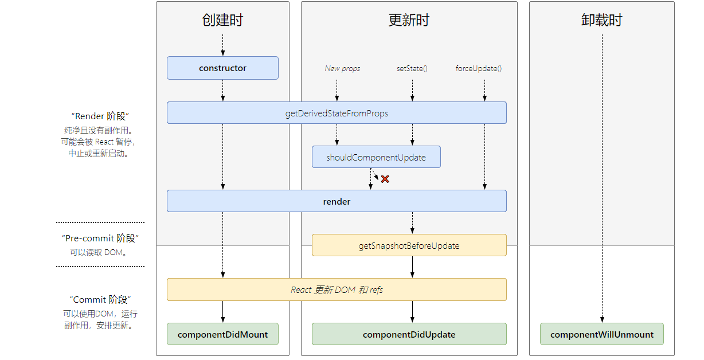

# 生命周期函数
>本章代码在 master 分支中


[React lifecycle methods diagram](http://projects.wojtekmaj.pl/react-lifecycle-methods-diagram/)

关于生命周期函数的用法，官方文档描述的已经够详细了，在此不再赘述。

## render 阶段

从图中可见，render 阶段包含 getDerivedStateFromProps 和 shouldComponentUpdate 函数。

* static getDerivedStateFromProps(props, state)

从上图可以看到 getDerivedStateFromProps 会在 render 函数之前触发，且在 mount 和 udpate 阶段都会触发。
mount 阶段可以在 mountClassInstance 中实现，update 阶段可以在 updateClassInstance 中实现

* shouldComponentUpdate(nextProps, nextState)

shouldComponentUpdate 只在 udpate 时触发，可以在 updateClassInstance 中实现。

```javascript
function applyDerivedStateFromProps (workInProgress, getDerivedStateFromProps, nextProps) {
  const prevState = workInProgress.memoizedState
  const partialState = getDerivedStateFromProps(nextProps, prevState)
  // Merge the partial state and the previous state.
  const memoizedState = partialState === null || partialState === undefined ? prevState : Object.assign({}, prevState, partialState)
  workInProgress.memoizedState = memoizedState
  // Once the update queue is empty, persist the derived state onto the
  // base state.
  const updateQueue = workInProgress.updateQueue
  if (updateQueue !== null && workInProgress.expirationTime === NoWork) {
    updateQueue.baseState = memoizedState
  }
}

function mountClassInstance(workInProgress, ctor, newProps) {
  let instance = workInProgress.stateNode
  instance.props = newProps
  instance.state = workInProgress.memoizedState
  const updateQueue = workInProgress.updateQueue
  if (updateQueue !== null) {
    processUpdateQueue(workInProgress, updateQueue)
    instance.state = workInProgress.memoizedState
  }
  const getDerivedStateFromProps = ctor.getDerivedStateFromProps
  if (typeof getDerivedStateFromProps === 'function') {
    applyDerivedStateFromProps(workInProgress, getDerivedStateFromProps, newProps)
    instance.state = workInProgress.memoizedState
  }
}
  
function checkShouldComponentUpdate(workInProgress, newProps, newState) {
  const instance = workInProgress.stateNode
  if (typeof instance.shouldComponentUpdate === 'function') {
    const shouldUpdate = instance.shouldComponentUpdate(newProps, newState)
    return shouldUpdate
  }
  return true
}

function updateClassInstance (current, workInProgress, ctor, newProps) {
  const instance = workInProgress.stateNode
  const oldProps = workInProgress.memoizedProps
  instance.props = oldProps
  const oldState = workInProgress.memoizedState
  let newState = instance.state = oldState
  let updateQueue = workInProgress.updateQueue
  if (updateQueue !== null) {
    processUpdateQueue(
      workInProgress,
      updateQueue
    )
    newState = workInProgress.memoizedState
  }
  if (oldProps === newProps && oldState === newState) {
    return false
  }
  const getDerivedStateFromProps = ctor.getDerivedStateFromProps
  if (typeof getDerivedStateFromProps === 'function') {
    applyDerivedStateFromProps(workInProgress, getDerivedStateFromProps, newProps)
    newState = workInProgress.memoizedState
  }
  const shouldUpdate = checkShouldComponentUpdate(workInProgress, newProps, newState)
  if (shouldUpdate) {
    if (typeof instance.componentDidUpdate === 'function') {
      // 需要标记上 Update 标签，才能被累积到 effect list 中，才能触发 componentDidUpdate 函数。
      workInProgress.effectTag |= Update
    }
  }
  instance.props = newProps
  instance.state = newState
  return shouldUpdate
}
```

## pre-commit 和 commit 阶段

pre-commit 阶段包含 getSnapshotBeforeUpdate 函数。commit 阶段包含 componentDidMount 和 componentDidUpdate 以及 componentWillUnmount 函数。

* getSnapshotBeforeUpdate(prevProps, prevState)

getSnapshotBeforeUpdate 在 update 阶段修改 DOM 之前触发。可以在 commitRoot 中实现。

* componentDidMount() 和 componentDidUpdate(prevProps, prevState, snapshot)

componentDidMount 在组件插入到 DOM 后触发，componentDidUpdate 在 DOM 更新之后触发。两个函数都在 commitRoot 中实现

* componentWillUnmount()

componentWillUnmount 在组件被卸载前触发，可以在 commitDeletion 中实现。

```javascript
function commitBeforeMutationLifeCycles (firstEffect) {
  let nextEffect = firstEffect 
  while (nextEffect !== null) {
    if (nextEffect.tag === ClassComponent) {
      const instance = nextEffect.stateNode
      const getSnapshotBeforeUpdate = nextEffect.stateNode.getSnapshotBeforeUpdate
      if (typeof getSnapshotBeforeUpdate === 'function') {
        const current = nextEffect.alternate
        const prevProps = current.memoizedProps
        const prevState = current.memoizedState
        instance.props = nextEffect.memoizedProps
        instance.state = nextEffect.memoizedState
        const snapshot = getSnapshotBeforeUpdate(prevProps, prevState)
        instance.__reactInternalSnapshotBeforeUpdate = snapshot
      }
    }    
    nextEffect = nextEffect.nextEffect
  }
}

function commitAllLifeCycles (firstEffect) {
  let nextEffect = firstEffect 
  while (nextEffect !== null) {
    if (nextEffect.tag === ClassComponent) {
      const instance = nextEffect.stateNode
      const componentDidMount = instance.componentDidMount
      const componentDidUpdate = instance.componentDidUpdate
      const current = nextEffect.alternate
      if (current === null) {
        if (typeof componentDidMount === 'function') {
          instance.props = nextEffect.memoizedProps
          instance.state = nextEffect.memoizedState
          instance.componentDidMount()
        }
      } else {
        if (typeof componentDidUpdate === 'function') {
          const prevProps = current.memoizedProps
          const prevState = current.memoizedState
          instance.props = nextEffect.memoizedProps
          instance.state = nextEffect.memoizedState
          instance.componentDidUpdate(prevProps, prevState, instance.__reactInternalSnapshotBeforeUpdate)
        }
      }
    }    
    nextEffect = nextEffect.nextEffect
  }
}

function commitRoot (root, finishedWork) {
  isWorking = true
  isCommitting = true
  root.expirationTime = NoWork
  const firstEffect = finishedWork.firstEffect
  // Invoke instances of getSnapshotBeforeUpdate before mutation
  commitBeforeMutationLifeCycles(firstEffect)
  // Commit all the side-effects within a tree. We'll do this in two passes.
  // The first pass performs all the host insertions, updates, deletions and
  // ref unmounts.
  commitAllHostEffects(firstEffect)
  // The work-in-progress tree is now the current tree. This must come after
  // the first pass of the commit phase, so that the previous tree is still
  // current during componentWillUnmount, but before the second pass, so that
  // the finished work is current during componentDidMount/Update.
  root.current = finishedWork
  // In the second pass we'll perform all life-cycles and ref callbacks.
  // Life-cycles happen as a separate pass so that all placements, updates,
  // and deletions in the entire tree have already been invoked.
  // This pass also triggers any renderer-specific initial effects.
  commitAllLifeCycles(firstEffect)
  isCommitting = false
  isWorking = false
}

function commitUnmount (current) {
  if (current.tag === ClassComponent) {
    const instance = current.stateNode
    if (typeof instance.componentWillUnmount === 'function') {
      instance.props = current.memoizedProps
      instance.state = current.memoizedState
      instance.componentWillUnmount()
    }
  }
}

function commitNestedUnmounts (root) {
  // While we're inside a removed host node we don't want to call
  // removeChild on the inner nodes because they're removed by the top
  // call anyway. We also want to call componentWillUnmount on all
  // composites before this host node is removed from the tree. Therefore
  let node = root
  while (true) {
    commitUnmount(node)
    // Visit children because they may contain more composite or host nodes.
    if (node.child !== null) {
      node.child.return = node
      node = node.child
      continue
    }
    if (node === root) {
      return
    }
    while (node.sibling === null) {
      if (node.return === null || node.return === root) {
        return
      }
      node = node.return
    }
    node.sibling.return = node.return
    node = node.sibling
  }
}

function commitDeletion (current) {
  const parentFiber = getHostParentFiber(current)
  const parent = parentFiber.tag === HostRoot ? parentFiber.stateNode.containerInfo : parentFiber.stateNode
  let node = current
  while (true) {
    if (node.tag === HostComponent) {
      commitNestedUnmounts(node)
      // After all the children have unmounted, it is now safe to remove the
      // node from the tree.
      removeChildFromContainer(parent, node.stateNode) 
    } else {
      commitUnmount(node)
      // Visit children because we may find more host components below.
      if (node.child !== null) {
        node.child.return = node
        node = node.child
        continue
      }
    }   
    if (node === current) {
      break
    }
    while (node.sibling === null) {
      if (node.return === null || node.return === current) {
        break
      }
      node = node.return
    }
    node.sibling.return = node.return
    node = node.sibling
  }
  current.return = null
  current.child = null
  if (current.alternate) {
    current.alternate.child = null
    current.alternate.return = null
  }
}
```