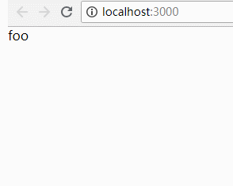

# Suspense
>本章的代码在Suspense分支中

## 学习资料

[fresh-async-react](https://github.com/sw-yx/fresh-async-react)

有很多 Suspense 部分的资料。

[kentcdodds/react-suspense-simple-example ](https://www.youtube.com/watch?v=7LmrS2sdMlo&feature=youtu.be&a=)

如何写一个简单的 suspense cache。

注意 [React 16.6 canary release](https://github.com/facebook/react/pull/13799) 中激活了 Suspense。而且将 Placeholder 重新命名为 Suspense。

## 原理

[@acdlite on how Suspense works](https://twitter.com/acdlite/status/969171217356746752)

* 在 render 函数中，从缓存中读取数据。
* 如果数据已经被缓存，继续正常的渲染。
* 如果数据没有被缓存，意味着可能需要向服务器发起请求，这时候就会抛出一个 promise。React 会捕获这个 promise 且暂停渲染。
*  当这个 promise resolves，React 会重新开始渲染。 

## 演示

```javascript
import React, { unstable_Suspense as Suspense } from 'react'
import { cache } from './cache'
import { createResource } from 'react-cache'

const sleep = (time, resolvedValue) =>
  new Promise(resolve => {
    setTimeout(() => resolve(resolvedValue), time)
  })
const myResource = createResource(id => sleep(3000, id))

class Foo extends React.Component {
  render () {
    const value = myResource.read(cache, 'foo')
    return (
     <div>{value}</div>
    )
  }
}
class App extends React.Component {
  render () {
    return (
    <Suspense maxDuration={1000} fallback={<div>'Loading....'</div>}>
      <Foo />
    </Suspense>
    )
  }
}

export default App
```
Suspense 组件会捕获其下的子组件抛出的 promise， 然后决定渲染什么。 当 promise 还没有 resolves 时，将渲染 fallback，当 promise resolves 时，再渲染 Foo 组件。maxDuration 表示等待多长的时间再渲染 fallback，因为如果数据获取足够迅速，并没有必要渲染 fallback。



可以看到点击刷新，等待 1 秒之后渲染 fallback，再等待 2 秒之后渲染 Foo 组件。

## 实现

实现 Suspense 将分为两个部分，第一个部分实现 suspense cache，第二个部分完善 fiber 架构来支持 suspense。

注意不会实现 maxDuration，意味着 fallback 必然会被渲染。

### suspense cache

新建 ReactCache.js

```javascript
export function createCache () {
  const resourceMap = new Map()
  const cache = {
    read (resourceType, key, loadResource) {
      let recordCache = resourceMap.get(resourceType)
      if (recordCache === undefined) {
        // 为每个 resource 创建单独的 recordCache
        recordCache = new Map()
        resourceMap.set(resourceType, recordCache)
      }
      let record = recordCache.get(key)
      if (record === undefined) {
        // 记录不存在
        const suspender = loadResource(key)
        suspender.then(value => {
          // 将数据保存在 recordCache 中
          recordCache.set(key, value)
          return value
        })
        // 抛出 promise
        throw suspender
      }
      // 直接返回记录
      return record
    }
  }
  return cache
}

export function createResource (loadResource) {
  const resource = {
    read (cache, key) {
      return cache.read(resource, key, loadResource)
    }
  }
  return resource
}
```

* 调用 createCache，会返回一个 cache。cache 提供了一个 read 方法，会为每一个 resource 创建一个 recordCache，然后尝试从 recordCache 中读取数据。如果数据存在，直接返回该数据。否则，抛出一个 promise。
当 promise resolves 时，会将数据保存在 recordCache 中。
* 调用 createResource 返回的 resource 也将提供一个 read 方法，调用 resource.read 其实就是在调用 cache.read。
* React 实现的 cache 还将提供 prelaod 方法。[@sebmarkbage on when to use preload() vs read()](https://twitter.com/sebmarkbage/status/1026514420908744704)。

### 完善 fiber 架构

1. 需要引入 React.Suspense。

修改 react 文件加下的 index.js.

```javascript
const React = {
  Component,
  createElement,
  // add React.Suspense
  Suspense: Symbol.for('react.suspense')
}
```

现在我们可以 import { Suspense } from React。

因为新增了 Suspense 组件，我们需要新增一个 workTag。修改 Reconciler.js。

```javascript
import {
  ClassComponent,
  HostRoot, 
  HostComponent,
  // suspense workTag
  SuspenseComponent
} from '../shared/ReactWorkTags'
```

2. JSX 中的 <Suspense> 实际上会被 Babel 调用 createElement 从而生成一个 ReactElement 对象。这个对象的 type 属性是 Symbol(react.suspense)。考虑到我们是通过 createFiberFromElement 函数把 ReactElement 对象转化为 fiber，所以需要修改 createFiberFromElement 函数。

```javascript
function createFiberFromElement (element, expirationTime) {
  let fiber
  const type = element.type
  const pendingProps = element.props
  let fiberTag
  if (typeof type === 'function') {
    fiberTag = ClassComponent
  } else if (typeof type === 'string') {
    fiberTag = HostComponent
  } else {
    // type is Symbol(react.suspense)
    fiberTag = SuspenseComponent
  }
  fiber = new FiberNode(fiberTag, pendingProps)
  fiber.type = type
  fiber.expirationTime = expirationTime
  return fiber
}
```

3. 现在有了 tag 为 SuspenseComponent 的 fiber，所有包含 switch(workInProgress.tag) 的函数都需要修改。

```javascript
function beginWork (current, workInProgress, renderExpirationTime) {
  workInProgress.expirationTime = NoWork
  const Component = workInProgress.type
  const unresolvedProps = workInProgress.pendingProps
  switch (workInProgress.tag) {
    case ClassComponent: {
      return updateClassComponent(current, workInProgress, Component, unresolvedProps, renderExpirationTime)
    }
    case HostRoot: {
      return updateHostRoot(current, workInProgress, renderExpirationTime)
    }
    case HostComponent: {
      return updateHostComponent(current, workInProgress, renderExpirationTime)
    }
    // new case
    case SuspenseComponent: {
      return updateSuspenseComponent(current, workInProgress, renderExpirationTime)
    }
    default:
      throw new Error('unknown unit of work tag') 
  }
}

function completeWork (current, workInProgress) {
  const newProps = workInProgress.pendingProps
  switch(workInProgress.tag) {
    case ClassComponent: {
      break
    }
    case HostRoot: {
      break
    }
    case HostComponent: {
      const type = workInProgress.type
      if (current !== null && workInProgress.stateNode != null) {
        const oldProps = current.memoizedProps
        const updatePayload = prepareUpdate(oldProps, newProps)
        workInProgress.updateQueue = updatePayload
        if (updatePayload) {
          markUpdate(workInProgress)
        }
      } else {
        const _instance = createInstance(type, newProps, workInProgress)
        appendAllChildren(_instance, workInProgress)
        finalizeInitialChildren(_instance, newProps)
        workInProgress.stateNode = _instance
      }
      break
    }
    // new case
    case SuspenseComponent: {
      break
    }
    default: {
      throw new Error('Unknown unit of work tag')
    }
  }
  return null
}

function commitWork (finishedWork) {
  switch (finishedWork.tag) {
    case HostRoot: 
    case ClassComponent: {
      return
    }
    case HostComponent: {
      const instance = finishedWork.stateNode
      if (instance != null) {
        const updatePayload = finishedWork.updateQueue
        finishedWork.updateQueue = null
        if (updatePayload !== null) {
          commitUpdate(instance, updatePayload)
        }
      }
      return
    }
    // new case
    case SuspenseComponent: {
      return
    }
    default: {
      throw new Error('This unit of work tag should not have side-effects')
    }
  }
}
```

4. 在 beginWork 中新增了 updateSuspenseComponent 函数。

```javascript
import { DidCapture } from '../shared/ReactSideEffectTags'

function updateSuspenseComponent (current, workInProgress, renderExpirationTime) {
  const nextProps = workInProgress.pendingProps
  const nextDidTimeout = (workInProgress.effectTag & DidCapture) !== NoEffect
  const nextChildren = nextDidTimeout ? nextProps.fallback : nextProps.children
  workInProgress.memoizedProps = nextProps
  workInProgress.memoizedState = nextDidTimeout
  reconcileChildren(current, workInProgress, nextChildren, renderExpirationTime)
  return workInProgress.child
}
``` 

* 通过 DidCapture 标签判断渲染 fallback 还是 children。

5. 当 mount 阶段调用 updateSuspenseComponent 时，会尝试渲染 children。在上面提到的例子中，会渲染 Foo组件，继而调用 Foo 组件的 render 函数，这时候就会抛出一个 promise。所以需要在某个地方 catch 这个 promise。

```javascript
function renderRoot (root, isYieldy) {
  isWorking = true
  const expirationTime = root.expirationTime
  if (expirationTime !== nextRenderExpirationTime || nextUnitOfWork === null) {
    nextRenderExpirationTime = expirationTime
    nextUnitOfWork = createWorkInProgress(root.current, null, nextRenderExpirationTime)
  }
  do {
    try {
      workLoop(isYieldy)
    } catch (thrownValue) {
      const sourceFiber = nextUnitOfWork
      const returnFiber = sourceFiber.return
      throwException(root, returnFiber, sourceFiber, thrownValue, nextRenderExpirationTime)
      nextUnitOfWork = completeUnitOfWork(sourceFiber)
      continue
    }
    break
  } while (true)
  isWorking = false
  if (nextUnitOfWork !== null) {
    return
  }
  root.finishedWork = root.current.alternate
}

function throwException(root, returnFiber, sourceFiber, value, renderExpirationTime) {
  // The source fiber did not complete.
  sourceFiber.effectTag |= Incomplete
  // Its effect list is no longer valid.
  sourceFiber.firstEffect = sourceFiber.lastEffect = null
  if (
    value !== null &&
    typeof value === 'object' &&
    typeof value.then === 'function'
  ) {
    // This is a thenable.
    const thenable = value
    // Schedule the nearest Placeholder to re-render the timed out view
    let workInProgress = returnFiber
    do {
      if (workInProgress.tag === SuspenseComponent) {
        // Found the nearest boundary.
        // Attach a listener to the promise to "ping" the root and retry
        const onResolve = retrySuspendedRoot.bind(
          null,
          root,
          workInProgress
        )
        thenable.then(onResolve)
        workInProgress.expirationTime = renderExpirationTime
        return
      }
      workInProgress = workInProgress.return
    } while (workInProgress !== null)
  }
}

function retrySuspendedRoot (root, fiber) {
  const currentTime = requestCurrentTime()
  const retryTime = computeExpirationForFiber(currentTime)
  root.expirationTime = retryTime
  scheduleWorkToRoot(fiber, retryTime)
  requestWork(root, root.expirationTime)
}
```

**renderRoot**

* 在 renderRoot 中，将 workLoop 放在 try 语句块中，如果抛出 promise ，将 promise 传入 catch 语句块。
* 如果有 promise 被抛出，执行完 throwException 和 completeUnitOfWork 后，将再次执行 workLoop。

**throwException**

* 传入 throwException 的 sourceFiber 参数是抛出 promise 的 fiber，将其标记上 Incomplete 标签，清空它的 effect list。
* 传入 throwException 的 value 参数即是抛出的 promise。在 promise 上绑定一个 resolves 时执行的函数 retrySuspendedRoot。


6. 由于在 throwException 中标记了 Incomplete，代表这个 fiber 还没有完成。所以需要完善 completeUnitOfWork。

```javascript
function completeUnitOfWork (workInProgress) {
  while (true) {
    const current = workInProgress.alternate
    const returnFiber = workInProgress.return
    const siblingFiber = workInProgress.sibling
    if ((workInProgress.effectTag & Incomplete) === NoEffect) {
      // This fiber completed.
      completeWork(current, workInProgress)
      if (returnFiber !== null &&
        (returnFiber.effectTag & Incomplete) === NoEffect) {
          if (returnFiber.firstEffect === null) {
            returnFiber.firstEffect = workInProgress.firstEffect
          }
          if (workInProgress.lastEffect !== null) {
            if (returnFiber.lastEffect !== null) {
              returnFiber.lastEffect.nextEffect = workInProgress.firstEffect
            }
            returnFiber.lastEffect = workInProgress.lastEffect
          }
          const effectTag = workInProgress.effectTag
          if (effectTag >= Placement) {
            if (returnFiber.lastEffect !== null) {
              returnFiber.lastEffect.nextEffect = workInProgress
            } else {
              returnFiber.firstEffect = workInProgress
            }
            returnFiber.lastEffect = workInProgress
          }
        }
      if (siblingFiber !== null) {
        return siblingFiber;
      } else if (returnFiber !== null) {
        workInProgress = returnFiber
        continue
      } else {
        return null
      }
    } else {
      // This fiber did not complete because something threw.
      if (workInProgress.tag === SuspenseComponent) {
        const effectTag = workInProgress.effectTag
        workInProgress.effectTag = effectTag & ~Incomplete | DidCapture
        return workInProgress
      }

      if (returnFiber !== null) {
        // Mark the parent fiber as incomplete and clear its effect list.
        returnFiber.firstEffect = returnFiber.lastEffect = null
        returnFiber.effectTag |= Incomplete
      }
      if (siblingFiber !== null) {
        // If there is more work to do in this returnFiber, do that next.
        return siblingFiber
      } else if (returnFiber !== null) {
        // If there's no more work in this returnFiber. Complete the returnFiber.
        workInProgress = returnFiber
        continue
      } else {
        return null
      }
    }
  }
}
```

**completeUnitOfWork**

* 当抛出 promise 的 fiber 没有完成时，会将这个 fiber 的 returnFiber 标记为 Incomplete。
* 所以当 complete 这个 returnFiber 时，会再次到未完成的分支。
* 直到当 complete 的 fiber 是 SuspenseComponent 时，会将其 Incomplete 标签去掉并标记上 DidCapture 标签。注意这时候直接返回 SuspenseComponent fiber。
* 这时候再执行 workLoop，在 updateSuspenseComponent 中就会决定渲染 fallback。

现在 Suspense 的整体流程已经很清楚了。以上面的简单组件为例，触发的函数流程图：


7. 由于例子包含了从 &lt;div&gt;Loading...&lt;/div&gt; 更新为 &lt;Foo /&gt; 组件的情况，所以需要先删除 &lt;div&gt;Loading...&lt;/div&gt;，再插入 &lt;Foo /&gt; 组件。因此就必须引入删除的逻辑。

```javascript
// in CustomDom.js
const hostConfig = {
  // ...
  removeChildFromContainer: (container, child) => {
    container.removeChild(child)
  }
}

// in Reconciler.js
function reconcileChildrenArray (returnFiber, currentFirstChild, newChildren, expirationTime) {
  let resultingFirstChild = null
  let previousNewFiber = null
  let oldFiber = currentFirstChild
  let newIdx = 0
  for (; oldFiber !== null && newIdx < newChildren.length; newIdx ++) {
    let newFiber = updateSlot(returnFiber, oldFiber, newChildren[newIdx], expirationTime)
    if (shouldTrackSideEffects) {
      if (oldFiber && newFiber.alternate === null) {
        // We matched the slot, but we didn't reuse the existing fiber, so we
        // need to delete the existing child.
        deleteChild(returnFiber, oldFiber)
        newFiber.effectTag = Placement
      }
    }
    if (resultingFirstChild === null) {
      resultingFirstChild = newFiber
    } else {
      previousNewFiber.sibling = newFiber
    }
    previousNewFiber = newFiber
    oldFiber = oldFiber.sibling
  }
 
  if (oldFiber === null) {
    for (; newIdx < newChildren.length; newIdx++) {
      let _newFiber = createChild(returnFiber, newChildren[newIdx], expirationTime)
      if (shouldTrackSideEffects && _newFiber.alternate === null) {
        _newFiber.effectTag = Placement
      }     
      if (resultingFirstChild === null) {
        resultingFirstChild = _newFiber
      } else {
        previousNewFiber.sibling = _newFiber
      }
      previousNewFiber = _newFiber
    }
    return resultingFirstChild
  }
}

function deleteChild (returnFiber, childToDelete) {
  // Deletions are added in reversed order so we add it to the front.
  // At this point, the return fiber's effect list is empty except for
  // deletions, so we can just append the deletion to the list. The remaining
  // effects aren't added until the complete phase. Once we implement
  // resuming, this may not be true.
  const last = returnFiber.lastEffect
  if (last !== null) {
    last.nextEffect = childToDelete
    returnFiber.lastEffect = childToDelete
  } else {
    returnFiber.firstEffect = returnFiber.lastEffect = childToDelete
  }
  childToDelete.nextEffect = null
  childToDelete.effectTag = Deletion
}

function updateElement (returnFiber, current, element, expirationTime) {
  if (current !== null && current.type === element.type) {
    // Update
    const existing = useFiber(current, element.props, expirationTime)
    existing.return = returnFiber
    return existing
  } else {
    // Insert
    const created = createFiberFromElement(element, expirationTime)
    created.return = returnFiber
    return created
  } 
}

function commitAllHostEffects (firstEffect) {
  let nextEffect = firstEffect
  while (nextEffect !== null) {
    const effectTag = nextEffect.effectTag
    switch(effectTag & (Placement | Update | Deletion)) {
      case Placement: {
        commitPlacement(nextEffect)
        nextEffect.effectTag &= ~Placement
        break
      }
      case Update: {
        commitWork(nextEffect)
        break
      }
      case Deletion: {
        commitDeletion(nextEffect)
        break
      }
    }
    nextEffect = nextEffect.nextEffect;
  }    
}

function commitDeletion (current) {
  // Recursively delete all host nodes from the parent.
  // Detach refs and call componentWillUnmount() on the whole subtree.
  const parentFiber = getHostParentFiber(current)
  // We only have the top Fiber that was deleted but we need recurse down its
  // children to find all the terminal nodes.
  const parent = parentFiber.tag === HostRoot ? parentFiber.stateNode.containerInfo : parentFiber.stateNode
  let node = current
  while (true) {
    if (node.tag === HostComponent) {
      removeChildFromContainer(parent, node.stateNode) 
    } else if (node.child !== null) {
      node.child.return = node
      node = node.child
      continue
    }
    if (node === current) {
      return
    }
    while (node.sibling === null) {
      if (node.return === null || node.return === current) {
        return
      }
      node = node.return
    }
    node.sibling.return = node.return
    node = node.sibling
  }
  // Cut off the return pointers to disconnect it from the tree. Ideally, we
  // should clear the child pointer of the parent alternate to let this
  // get GC:ed but we don't know which for sure which parent is the current
  // one so we'll settle for GC:ing the subtree of this child. This child
  // itself will be GC:ed when the parent updates the next time.
  current.return = null
  current.child = null
  if (current.alternate) {
    current.alternate.child = null;
    current.alternate.return = null;
  }
}
```

修改 App.js

```javascript
import React from './react';
import { createCache, createResource } from './cache/ReactCache'

const cache = createCache()
const sleep = (time, resolvedValue) =>
  new Promise(resolve => {
    setTimeout(() => resolve(resolvedValue), time)
  })
const myResource = createResource(id => sleep(3000, id))

class Foo extends React.Component {
  render () {
    const value = myResource.read(cache, 'foo')
    return (
     <div>{value}</div>
    )
  }
}

class App extends React.Component {
  render () {
    return (
    <React.Suspense fallback={<div>Loading....</div>}>
      <Foo />
    </React.Suspense>
    )
  }
}

export default App
```

现在运行项目：


